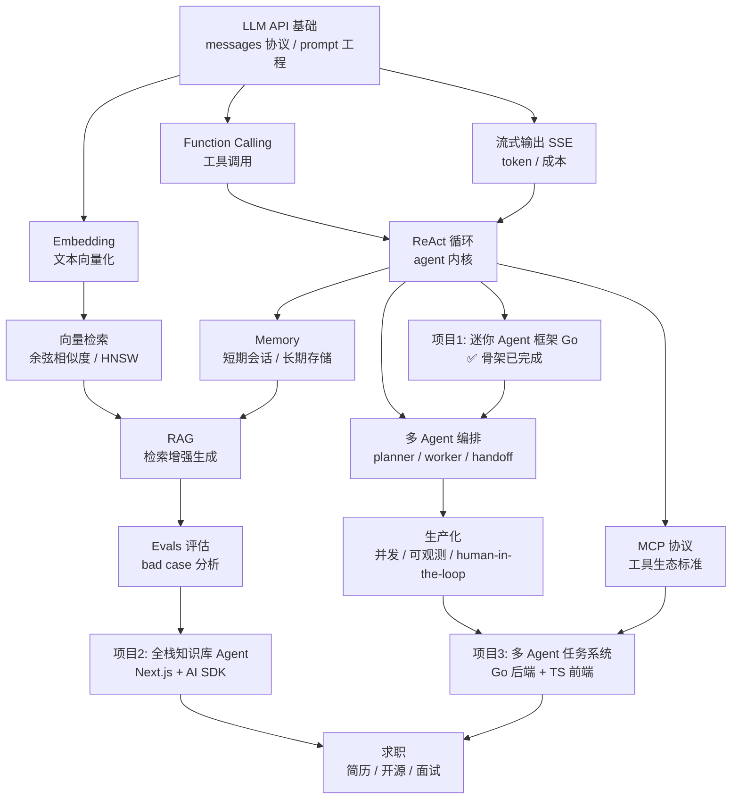

# 总目标与路线图（ROADMAP）

> **本文档是任何时候打开本仓库都应该先读的文件。**
> 新对话开始时，把本文件 + 当前阶段的 `docs/stages/stage-XX-*.md` 发给 AI，即可无损恢复上下文。

## 总目标

以 **3-6 个月内拿到 AI Agent 开发岗位 offer** 为目标，个人开发者自学。

- 目标岗位：**AI 后端/infra（Go）+ AI 应用/全栈（TypeScript）双路线**
- 策略：以 3 个可写进简历的项目为主线，边做边学，所有知识落到代码和文档上
- 当前基础：已调过大模型 API，未做过完整 agent 项目

## 技术栈约定

| 类别      | 选择                                        | 原因                      |
| --------- | ------------------------------------------- | ------------------------- |
| 生成模型  | DeepSeek `deepseek-chat`（OpenAI 兼容 API） | 便宜，缓存命中成本极低    |
| Embedding | bge-m3（硅基流动免费档 / Ollama 本地）      | DeepSeek 无 embedding API |
| 向量库    | 先纯内存实现 → pgvector                     | 先理解原理再用库          |
| 后端      | Go                                          | 目标岗位技术栈            |
| 前端/全栈 | TypeScript + Next.js + Vercel AI SDK        | AI 应用岗主流组合         |
| 可观测性  | Langfuse（自托管）                          | 开源免费，阶段三用        |

---

## 知识拓扑图

读法：箭头 = 依赖关系。每个节点都是面试考点，叶子项目节点是简历产出。

---

## 分阶段计划表

### 阶段一：地基（第 1-4 周）— ✅ 已完成（2026-08-06 验收通过）

| 类别 | 内容                                            | 状态                    |
| ---- | ----------------------------------------------- | ----------------------- |
| 概念 | messages 四角色协议、prompt 工程、结构化输出    | ✅ 已覆盖（见阶段文档） |
| 概念 | Function Calling 本质：模型只发请求不执行代码   | ✅                      |
| 概念 | ReAct 循环、对话历史即状态                      | ✅                      |
| 概念 | 流式输出 SSE、token 与成本控制                  | ✅                      |
| 工具 | Go + DeepSeek API（手写 HTTP 客户端，不用框架） | ✅                      |
| 项目 | **项目 1：`mini-agent/` 迷你 Agent 框架**       | ✅ 骨架 + 4 个练习全部完成 |
| 沉淀 | `docs/stages/stage-01-foundations.md`           | ✅                      |

验收标准：CLI 能跑通多工具调用 + 能手画 ReAct 循环图 + 完成 SSE 练习。

### 阶段二：进阶（第 5-10 周）— 🔄 进行中

| 类别 | 内容                                                                                     |
| ---- | ---------------------------------------------------------------------------------------- |
| 概念 | Embedding、chunking 策略、余弦相似度 / HNSW、混合检索、rerank                            |
| 概念 | RAG 全链路、Memory 设计（短期/长期）、Evals 评估方法                                     |
| 工具 | 硅基流动 embedding API、pgvector、Next.js、Vercel AI SDK                                 |
| 项目 | Go 概念部分：`mini-agent/` 原基础上扩展（embedding / 向量库 / RAG 工具 / Memory 新包）   |
| 项目 | **项目 2：`stage-02-kb-agent/` 全栈知识库 Agent**（文档上传→检索→带引用回答 + eval 脚本） |
| 沉淀 | `docs/embedding-vectordb-guide.md` ✅ 已预写；`docs/stages/stage-02-rag-memory-evals.md` |

> 结构决策：阶段二 Go 概念练习复用 mini-agent 的 llm 客户端与 ReAct 循环，不开新 Go 项目；
> 项目 2 是独立 TS 全栈项目，命名带阶段前缀（`stage-02-`）以区分阶段产出。

验收标准：RAG bad case 三板斧（检索不到 / 答非所问 / 编造）能讲清并能用 eval 量化。

### 阶段三：深入（第 11-16 周）— ⬜ 未开始

| 类别 | 内容                                                                                      |
| ---- | ----------------------------------------------------------------------------------------- |
| 概念 | 多 Agent 编排（planner/worker/critic、handoff）、并发控制                                 |
| 概念 | 生产化：错误恢复、human-in-the-loop、成本与延迟权衡                                       |
| 工具 | Go 并发（goroutine/channel 编排 agent 任务）、Postgres 持久化、Langfuse trace、MCP server |
| 项目 | **项目 3：多 Agent 任务系统**（Go 编排引擎 + TS 实时看板，简历主力项目）                  |

验收标准：架构文档 + 能讲清"为什么这样拆 agent、失败如何处理"。

### 阶段四：求职（第 17-20 周）— ⬜ 未开始

- 简历：3 个项目按"问题 → 架构 → 量化结果"写
- 开源：迷你框架或 MCP server 单独开源（英文 README）；给开源项目提 PR
- 面试题库：ReAct 原理、RAG 调优、防幻觉、长 context 处理、agent 评估
- 投递：Go 岗投云厂商/AI infra 公司，TS 岗投 AI 应用创业公司

---

## 进度速览

| 里程碑                                      | 状态 | 日期       |
| ------------------------------------------- | ---- | ---------- |
| 学习路线规划                                | ✅   | 2026-08-04 |
| 项目 1 骨架（ReAct 循环 + 2 工具）          | ✅   | 2026-08-04 |
| 注释规范固化（AGENTS.md）                   | ✅   | 2026-08-04 |
| embedding/向量库指南预写                    | ✅   | 2026-08-04 |
| 项目 1 练习：SSE 流式（含 tool_calls 聚合） | ✅   | 2026-08-05 |
| 项目 1 练习：重试退避                       | ✅   |            |
| 项目 1 练习：上下文压缩                     | ✅   |            |
| 项目 1 验收                                 | ✅   |            |
| 阶段二启动                                  | ✅   | 2026-08-06 |

> 状态图例：✅ 完成 / 🔄 进行中 / 📖 学习中 / ⬜ 未开始

---

## 文档地图

| 文件                                      | 作用                                                             |
| ----------------------------------------- | ---------------------------------------------------------------- |
| `AGENTS.md`                               | 项目规则：注释规范、技术栈约定、渐进开发约定                     |
| `docs/ROADMAP.md`                         | 本文件：总目标、计划表、知识拓扑、进度                           |
| `docs/stages/stage-XX-*.md`               | 每个阶段的沉淀：学什么、核心概念、注意事项、下一步               |
| `docs/solutions/stage-XX/exercise-N-*.md` | 练习参考答案：参考实现 + 关键设计点 + 对照清单（完成练习后再看） |
| `docs/embedding-vectordb-guide.md`        | 阶段二预习材料：embedding 与向量库实战指南                       |
| `mini-agent/`                             | 项目 1 代码；阶段二 Go 概念练习（embedding/向量库/RAG）在此扩展 |
| `stage-02-kb-agent/`                      | 项目 2 代码（阶段二启动后创建）：全栈知识库 Agent                |
