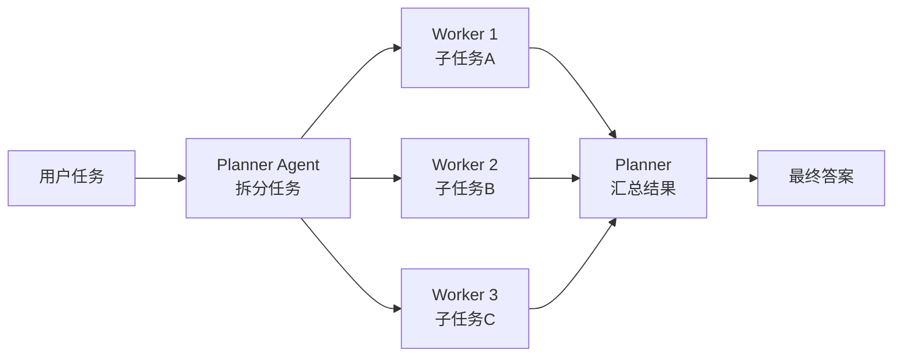
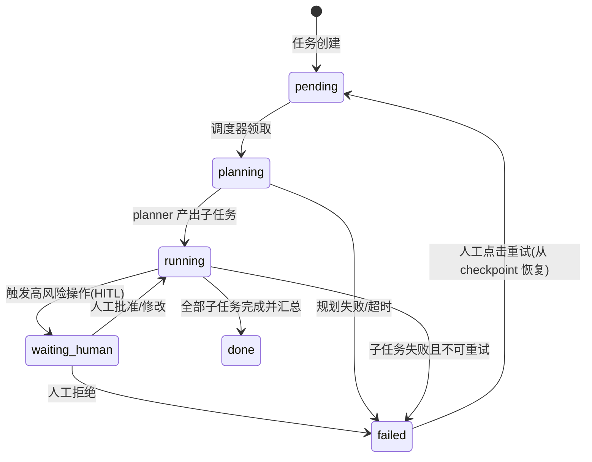
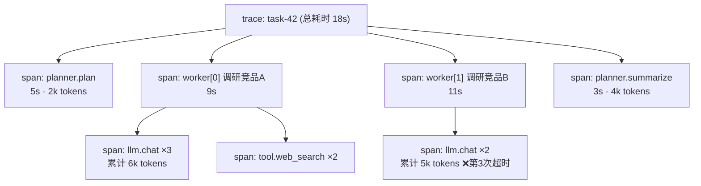
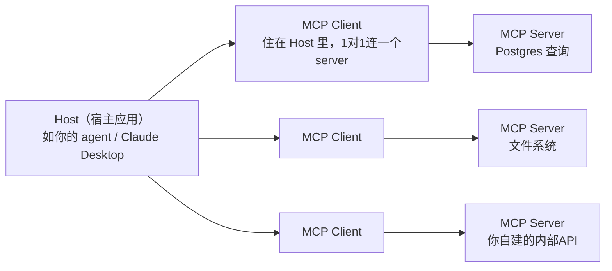

# 多 Agent 编排与 Go 并发实战指南

> **阶段三预习材料**，配套阶段文档：[stages/stage-03-multi-agent-production.md](stages/stage-03-multi-agent-production.md)。
> 定位：阶段三（多 Agent 任务系统）开工前的概念预习 + Go 并发速查。读完应达到：四种编排模式能画出来、知道什么时候用；Go 并发原语敢动手写；生产化清单能背。
> 技术栈：Go（编排引擎）+ TypeScript（实时看板），模型 DeepSeek。

---

## 一、为什么需要多 Agent（以及什么时候不需要）

### 单 Agent + 多工具的三面墙

阶段一的 ReAct 循环是一个 agent 挂 N 个工具。工具一多，会撞上三面墙：

1. **Context 膨胀**：每轮循环都要把全部工具 schema + 累积的对话历史发给模型。20 个工具的 schema 就是几千 token，长任务里中间结果还在不断堆。token 成本线性涨，模型的注意力反而被稀释——无关工具的描述干扰了它对当前任务的判断。
2. **工具选择准确率下降**：工具数量上去后，模型选错工具、填错参数的概率明显上升。schema 之间相似（比如 `search_docs` 和 `search_web`）时尤其严重。经验值：超过 10~15 个工具就要考虑分组或拆分。
3. **单一 prompt 难维护多职责**：让一个 system prompt 同时规定"如何规划、如何写代码、如何审查、如何汇报"，结果是每条规则都互相稀释。职责不同的模块，prompt 应该分开调优。

多 Agent 的思路：**把"一个大脑什么都要管"拆成"多个专职 agent 协作"**——每个 agent 有独立的 prompt、工具子集和上下文窗口，之间用明确的接口（任务描述、结构化结果）通信。

### 多 Agent 的代价（先泼冷水）

| 代价 | 具体表现 |
|---|---|
| 状态一致性 | 多个 agent 各自有上下文，共享信息靠什么？数据库？消息传递？出 bug 时状态散落在各处 |
| 成本 | planner 一次调用 + N 个 worker 各一次调用，token 消耗是单 agent 的数倍 |
| 调试复杂度 | 单 agent 失败看一条线性 log 就行；多 agent 失败要还原"谁在什么时间把什么传给了谁"，必须上树状 trace（见第六节） |

### "能单 Agent 就别多 Agent"的判断框架

面试高频题："你怎么决定拆不拆 agent？" 按顺序问自己：

1. **加 prompt / 改工具描述能解决吗？** 能，就别拆。90% 的"需要多 agent"的直觉，其实是 prompt 没写好。
2. **加工具能解决吗？** 任务是"串行流程长"而不是"职责真的不同"，用工具 + 状态机（workflow）更稳。
3. **拆了之后有明确的边界吗？** 好的拆分边界：职责不同（规划 vs 执行）、上下文不该共享（worker 不需要知道全局）、需要独立失败重试。坏的边界：为了拆而拆，拆完发现每个 agent 都需要全量信息。
4. **能接受 3~5 倍的 token 成本和更复杂的调试吗？** 不能，就回去优化单 agent。

> 一句话版本（可直接背）：**先 prompt，再工具，再 workflow，最后才 multi-agent**。Anthropic 在 "Building effective agents" 里的原话就是"find the simplest solution possible, and only increase complexity when needed"。

---

## 二、四种编排模式

### 1. Planner-Worker（规划-执行）

最主流的模式。一个 planner agent 把大任务拆成子任务，分发给多个 worker 并行执行，最后汇总。



- **适用场景**：任务可并行拆解（"调研三个竞品的定价策略"）、子任务之间无强依赖或依赖可显式声明。
- **真实系统**：Devin 的 planner 把 issue 拆成步骤分派执行；Claude Code 的 Task tool 起 subagent 跑独立子任务；LangGraph 的 supervisor 模式。

```go
// Planner 和 Worker 都是满足同一接口的 agent——多态是编排的基础
type Agent interface {
	// Run 执行一个（子）任务，ctx 携带超时与取消信号（见第三节）
	Run(ctx context.Context, task string) (Result, error)
}

type Planner struct {
	llm     llm.Client
	workers map[string]Agent // worker 按能力注册，planner 按名字分派
}

func (p *Planner) Run(ctx context.Context, task string) (Result, error) {
	// 1. 让 LLM 把 task 拆成 []SubTask（要求输出 JSON，含 worker 名和子任务描述）
	subs, err := p.plan(ctx, task)
	if err != nil {
		return Result{}, err
	}
	// 2. 用 errgroup 并行跑子任务（代码骨架见第三节）
	results, err := runParallel(ctx, subs, p.workers)
	if err != nil {
		return Result{}, err
	}
	// 3. 把子结果拼回上下文，让 LLM 汇总出最终答案
	return p.summarize(ctx, task, results)
}
```

### 2. Critic-Reviewer（生成-评审）

一个 agent 生成，另一个 agent 评审打分，不达标就打回重写，直到通过或达到最大轮数。

- **适用场景**：输出质量比速度重要、且"好不好"能被另一个模型大致判断的任务（写代码、写文案、长报告）。
- **真实系统**：Reflection 模式（吴恩达推广）、AlphaCodium 的测试迭代、很多代码生成产品的 "self-review" 步骤。

```go
// Generator 和 Critic 之间是"提案-反馈"循环，本质是 ReAct 的双 agent 版
func GenerateWithReview(ctx context.Context, gen, critic Agent, task string, maxRounds int) (Result, error) {
	draft, err := gen.Run(ctx, task)
	for round := 0; round < maxRounds && err == nil; round++ {
		// Critic 的 prompt 要求输出结构化评审：pass bool + feedback string
		review, rerr := critic.Run(ctx, reviewPrompt(task, draft))
		if rerr != nil {
			return Result{}, rerr
		}
		if review.Pass {
			return draft, nil // 通过评审，收工
		}
		// 把评审意见反馈给 generator 重写——注意 feedback 要进上下文，否则白评审
		draft, err = gen.Run(ctx, revisePrompt(task, draft, review.Feedback))
	}
	return Result{}, fmt.Errorf("达到最大评审轮数 %d: %w", maxRounds, err)
}
```

> 面试提示：被问"怎么保证 agent 输出质量"时，critic 模式 + maxRounds 兜底（防止无限循环烧 token）是标准答案的一半，另一半是 eval（阶段二内容）。

### 3. Handoff（接力/路由）

一个 agent 判断"这活不归我管"，把整个对话状态转交给更合适的 agent。类似客服系统的转接。

- **适用场景**：多领域入口（售前/售后/技术支持客服）、任务在运行中才发现需要别的专长。
- **真实系统**：OpenAI Agents SDK 的一等公民就是 handoff；ChatGPT 的插件路由、多专家客服 bot。

```go
// Handoff 的关键：转交的不只是"新任务"，而是整个对话上下文（否则用户得重说一遍）
type Router struct {
	llm      llm.Client
	handlers map[string]Agent // 各领域的专职 agent
}

func (r *Router) Run(ctx context.Context, history []Message) (Result, error) {
	// LLM 输出路由决策：{"agent": "refund-agent", "reason": "..."}
	target, err := r.route(ctx, history)
	if err != nil {
		return Result{}, err
	}
	// 把 history 原样转交给目标 agent——状态随任务走，这是 handoff 和 planner 的本质区别
	return r.handlers[target.Agent].Run(ctx, history)
}
```

> 辨析（面试易混）：**planner-worker 是"拆任务"，子任务结果回流；handoff 是"转责任"，控制权一去不复返**。前者是分而治之，后者是负载路由。

### 4. 群聊式（Multi-Agent Conversation）

多个 agent 在一个共享消息流里轮流发言，由轮询策略或一个 moderator 决定谁接话。AutoGen 的 GroupChat 是代表。

- **适用场景**：研究性/开放性任务（辩论、brainstorm、多视角评审），没有明确的任务树。
- **代价最高**：每个 agent 每轮都看全量消息，token 消耗随 agent 数 × 轮数爆炸；终止条件难设计（什么时候算聊完？）。
- **真实系统**：AutoGen GroupChat、CAMEL。工业界用得比前三种少——学习价值在理解"为什么不常用"。

```go
// 群聊 = 共享黑板 + 轮流发言 + 终止判断，骨架刻意简单（生产慎用）
func groupChat(ctx context.Context, agents []Agent, topic string, maxTurns int) ([]Message, error) {
	board := []Message{{Role: "user", Content: topic}} // 共享消息板
	for turn := 0; turn < maxTurns; turn++ {
		speaker := agents[turn%len(agents)] // 最朴素的轮询；进阶版由 moderator LLM 选
		msg, err := speaker.Run(ctx, formatBoard(board))
		if err != nil {
			return board, err
		}
		board = append(board, msg)
		if isConverged(board) { // 终止条件：达成共识/无新信息，最难设计的部分
			break
		}
	}
	return board, nil
}
```

### 四种模式速查表

| 模式 | 一句话 | 信息流 | 成本 | 何时用 |
|---|---|---|---|---|
| Planner-Worker | 拆任务、并行干、汇总 | 树状，结果回流 | 中 | 可并行拆解的大任务 |
| Critic-Reviewer | 生成-评审-重写循环 | 双 agent 往返 | 中 | 质量敏感、可自动评审 |
| Handoff | 判断归属、整体转交 | 线性转移 | 低 | 多领域路由 |
| 群聊式 | 共享黑板轮流发言 | 广播 | 高 | 开放性研讨（少用） |

---

## 三、Go 并发原语速查（本指南工程核心）

阶段三的项目 3 要用 goroutine/channel 编排 agent 任务。这一节按"要用的顺序"讲，每个原语配骨架代码。

### 1. goroutine + WaitGroup：基础与"启动即忘"反模式

```go
var wg sync.WaitGroup
results := make([]Result, len(tasks))

for i, task := range tasks {
	wg.Add(1)
	go func(i int, task Task) { // 参数显式传入，不依赖闭包捕获
		defer wg.Done()
		r, err := worker.Run(context.Background(), task)
		if err != nil {
			results[i] = Result{Err: err} // 错误也要收进结果，不能丢
			return
		}
		results[i] = r // 各写各的下标，无数据竞争，不需要锁
	}(i, task)
}
wg.Wait() // 主 goroutine 等所有 worker 结束
```

**"启动即忘"（fire-and-forget）反模式**：`go worker.Run(...)` 之后不等、不收错误、不传 context。进程退出时 goroutine 被强杀，跑到一半的 LLM 调用白花了钱还没结果。**每个 goroutine 都要回答三个问题：谁等它结束？错误给谁？怎么让它停下来？**

### 2. errgroup：一错全停 vs 收集部分结果

`golang.org/x/sync/errgroup` = WaitGroup + 错误收集 + context 取消。这是阶段三第一个要引入的外部依赖，它替代的就是上面手写的 WaitGroup 模板。

**模式 A：一错全停**（子任务缺一不可，如汇总报告的所有章节）：

```go
var mu sync.Mutex // append 到共享 slice 必须加锁（对比 WaitGroup 例的按下标写）
var results []Result

g, ctx := errgroup.WithContext(ctx) // 任何一个出错，ctx 自动取消，其余 worker 及时止损
for _, sub := range subs {
	sub := sub // Go 1.22 前必须这行；1.22+ 已修复但写出来可读性好（见"常见坑"）
	g.Go(func() error {
		r, err := worker.Run(ctx, sub) // worker 内部必须监听 ctx.Done()
		if err == nil {
			mu.Lock()
			results = append(results, r)
			mu.Unlock()
		}
		return err // 第一个非 nil error 会取消整个 group
	})
}
if err := g.Wait(); err != nil {
	return nil, err // g.Wait 返回第一个错误
}
```

**模式 B：收集部分结果**（允许部分失败，如"调研 5 个来源，拿到 3 个就够用"）：不用 errgroup 的 error 传播，把 error 当普通结果收进结构体，`g.Go` 永远返回 nil：

```go
outcomes := make([]Outcome, len(subs)) // 预分配，各写各的下标，无锁（同 WaitGroup 例）

g, _ := errgroup.WithContext(ctx)
for i, sub := range subs {
	i, sub := i, sub
	g.Go(func() error {
		r, err := worker.Run(ctx, sub)
		outcomes[i] = Outcome{Result: r, Err: err} // 成败都记录，由上层决定容忍度
		return nil                                 // 不传播错误，group 不会因单点失败取消
	})
}
_ = g.Wait() // 只会等到全部跑完，err 恒为 nil
```

> 面试高频：**errgroup 和 WaitGroup 的区别？** 三点：① errgroup 收集第一个 error；② `WithContext` 出错自动取消其余 goroutine；③ `Go` 内建 Add/Done，不会忘调 Done。另外 errgroup 还有 `SetLimit(n)` 限制并发数（Go 1.20+ 的 x/sync 版本），很多场景可以不用 semaphore。

### 3. context：取消传播与超时预算分配

context 是 Go 里跨 API 边界传递"死线和取消信号"的标准机制。多级 agent 调用里，**超时预算要像分钱一样从顶层往下分**：

```go
// 顶层：整个任务最多 30 秒（用户等不起更久）
ctx, cancel := context.WithTimeout(parentCtx, 30*time.Second)
defer cancel()

// Planner 分 5 秒：规划不该占大头，它是开销不是产出
planCtx, planCancel := context.WithTimeout(ctx, 5*time.Second)
defer planCancel()
subs, err := planner.plan(planCtx, task)

// 每个 Worker 分 10 秒：从父 ctx 派生，父死子必死
// 注意 5+10+汇总时间 < 30，要给网络抖动留余量，不能把预算花光
for _, sub := range subs {
	workerCtx, workerCancel := context.WithTimeout(ctx, 10*time.Second)
	// ... 传给 worker.Run(workerCtx, sub)
	workerCancel()
}
```

原则：

- **父取消 → 所有子孙自动取消**，这就是 errgroup "一错全停"能止损的底层机制。
- **子超时 ≠ 父超时**：worker 10 秒超时返回，不影响其他 worker 的剩余预算。
- **HTTP 客户端要真把 ctx 传下去**（`http.NewRequestWithContext`），否则 context 只是摆设——阶段一的 LLM 客户端如果没接 ctx，阶段三第一件事就是补上。
- `defer cancel()` 不漏调：漏了不是泄漏 goroutine，是让 timer 资源多活到超时点。

### 4. semaphore：对 LLM API 的并发限流

DeepSeek 这类 API 有 QPS 限制，100 个子任务同时打过去就是 429。用信号量限制并发数：

**方式 A：`golang.org/x/sync/semaphore`（官方库）**：

```go
sem := semaphore.NewWeighted(5) // 最多 5 个并发 LLM 调用

g, ctx := errgroup.WithContext(ctx)
for _, sub := range subs {
	sub := sub
	g.Go(func() error {
		if err := sem.Acquire(ctx, 1); err != nil { // Acquire 也听 ctx，等待时可被取消
			return err
		}
		defer sem.Release(1)
		return worker.Run(ctx, sub)
	})
}
```

**方式 B：带缓冲 channel 手写（面试常要求手写）**：

```go
sem := make(chan struct{}, 5) // 容量即并发上限

g.Go(func() error {
	sem <- struct{}{}        // 拿令牌：满了就阻塞在这
	defer func() { <-sem }() // 还令牌
	return worker.Run(ctx, sub)
})
```

两种方式等价，channel 版的优势是能顺手用 `select` 加超时。面试被问"怎么限流"，先说 semaphore 语义，再说 Go 里两种实现，是完整答案。

### 5. fan-in / fan-out 模式

fan-out：一个任务源分发给多个 worker；fan-in：多个 worker 的结果汇入一个 channel。这是 planner-worker 的 channel 版表达：

```go
// fan-out：任务 channel 被 N 个 worker 消费
tasks := make(chan Task)
results := make(chan Outcome) // Outcome 同时携带结果和错误（同 errgroup 模式 B）

for w := 0; w < numWorkers; w++ {
	go func() {
		for task := range tasks { // channel 关闭时 range 退出——关闭即"下班通知"
			r, err := worker.Run(ctx, task)
			results <- Outcome{Result: r, Err: err}
		}
	}()
}

// fan-in：主 goroutine 从单一 results channel 收结果，收够 N 个为止
go func() {
	for _, t := range allTasks {
		tasks <- t
	}
	close(tasks) // 由"唯一的发送方"关闭（见"常见坑"第 3 条）
}()

for i := 0; i < len(allTasks); i++ {
	r := <-results
	merge(r)
}
```

什么时候用 channel 版而不是 errgroup 版？**任务流是动态产生的**（planner 边想边派，或 worker 产出新任务）时 channel 更自然；任务列表一开始就全知道，errgroup 更省事。

### 6. 常见坑（面试 + 实战双重高频）

1. **goroutine 泄漏**：goroutine 阻塞在永远不写的 channel 或永不返回的调用上，进程不死它不死，内存慢慢涨。排查：`pprof` 看 goroutine 数量和调用栈。预防：每个 goroutine 都有退出路径（ctx 取消或 channel 关闭）。
2. **loop 变量捕获**：Go 1.22 之前，`for _, v := range xs { go func() { use(v) } }` 里所有 goroutine 共享同一个 `v`，跑到最后大家都拿到最后一个值。1.22+ 每次迭代都是新变量，已修复——但面试必问这段历史，且老代码库里 still 到处是 `v := v` 的防御写法，见到要认识。
3. **channel 关闭原则**：**只有发送方能关，且最好只有一个发送方**；接收方关 channel 或向已关闭的 channel 发送都会 panic。多个发送方时用 WaitGroup 等所有发送方结束后由专人关。
4. **共享 slice append 要加锁**：各写各的下标安全，append 不安全（可能触发扩容，两 goroutine 互相覆盖）。
5. **map 并发读写 fatal error**：不是 data race 警告，是直接 `fatal error: concurrent map read and map write`，程序必崩。用锁或 `sync.Map`。

---

## 四、状态持久化与崩溃恢复

### 任务状态机

多 agent 任务动辄跑几分钟，中间可能等人工审批。进程一崩，没持久化就全白跑（token 也白花了）。所以任务必须是显式状态机：



要点：**状态流转是单向、显式、落库的**。每次流转写一条记录（谁、什么时间、从哪到哪、为什么），这张流转表本身就是最好的调试材料。

### Checkpoint 该存什么

崩溃恢复的本质问题：**重启后要恢复到"接着跑"的状态，需要哪些信息？**

| 内容 | 为什么存 |
|---|---|
| `messages`（对话历史） | 对话历史即状态（阶段一的核心认知）——有它就能让 agent "想起"之前的一切 |
| 当前状态机的状态 + 当前步骤 | 知道该从哪一步继续，而不是从头再来 |
| 中间产物 | worker 已完成的子任务结果——重跑一遍等于重花一遍 token |
| 幂等键（idempotency key） | 见下 |

存储选型：项目 3 用 Postgres（阶段三工具链已定），一张 `tasks` 表（状态机字段）+ 一张 `checkpoints` 表（JSONB 存 messages 和中间产物）。

### 恢复 = 重建上下文 + 重放

恢复不是"接着断点单步执行"（程序做不到），而是：

1. 从最近 checkpoint 读出 messages 和已完成的子任务结果；
2. 重建 agent 上下文（把 messages 塞回 agent）；
3. 只重放**未完成**的子任务，已完成的直接用存档结果。

> 这就是为什么中间产物必须进 checkpoint：恢复粒度 = checkpoint 粒度。存得越频繁，崩溃损失越小，存储开销越大——工程上的权衡点，面试可聊。

### 幂等键（idempotency key）

重放子任务时，怎么防止"崩溃前其实已经调成功了，重放又调一遍"（比如"创建工单"被创建两次）？给每个副作用操作生成幂等键（如 `taskID + subTaskID + opType`），执行前先查这个键有没有成功记录：有就直接用旧结果，没有才真执行。

> 这是分布式系统的通用概念（支付重试防重复扣款用的就是它），在 agent 系统里对应"工具调用的去重"。**重试的前提永远是幂等**——这句话面试直接背。

---

## 五、生产化清单

这一节是项目 3 验收和面试"你的系统怎么上生产"的共用答案，逐条要能说"为什么"和"怎么做"。

1. **超时：每一级调用都有死线**
   顶层任务 30s → planner 5s → worker 10s → 单次 LLM 调用 10s → 单次工具调用 5s。没有任何一级是"无限等"。没有超时的系统，一个卡死的 API 就能把全部 worker 吊死（goroutine 泄漏的生产版）。
2. **重试：指数退避 + 幂等前提**
   429/5xx/网络抖动值得重试，4xx（参数错误）重试无意义。退避：1s → 2s → 4s，加随机 jitter 防惊群，最多 3 次。前提：操作幂等（见第四节幂等键），否则重试制造重复副作用。
3. **限流：对 LLM API 的 QPS 敬畏**
   信号量限制并发（第三节第 4 条）。更进一步是令牌桶控制 QPS 而不仅是并发数——100 个长请求并发 5 个也可能超 QPS。个人学习阶段 semaphore 够用，但面试要知道两层区别。
4. **熔断：成本预算熔断**
   传统熔断防的是下游故障；agent 系统还要防**成本失控**：ReAct 循环死循环、群聊式停不下来，都是烧钱机器。给单任务设 token 上限（如 100k tokens），每次 LLM 调用后累计，超限直接熔断任务进 `failed` 状态。**这是 agent 系统特有的熔断语义，讲出来是加分项。**
5. **优雅关闭：SIGINT 时存 checkpoint**

```go
// 收到 Ctrl-C 不立刻退出，给正在跑的任务一个"存档再走"的机会
sigCh := make(chan os.Signal, 1)
signal.Notify(sigCh, os.Interrupt, syscall.SIGTERM)

go func() {
	<-sigCh
	cancel() // 取消根 ctx，所有 worker 收到信号
}()

// worker 的 ctx.Done() 分支里：把 messages + 中间产物写 checkpoint，再返回
```

   要点：取消之后还要给存档操作留一个**独立的短超时 ctx**（不能再用已取消的 ctx，否则存档本身也被取消了——非常常见的坑）。

---

## 六、可观测与 Langfuse

### 为什么 agent 系统的日志必须是树状 trace

单 agent 的线性 log 够用：按时间顺序一行行看。多 agent 系统里，10 个 worker 的日志按时间交错打印，一行都看不懂。你需要回答的问题是**"任务 X 的 worker 3 为什么失败"**——这是一个**按调用层级聚合**的查询，不是按时间的查询。

OpenTelemetry 的概念（最小版）：

- **Trace**：一次完整任务的全程（对应我们的 taskID），是一棵 span 树；
- **Span**：树上一个节点 = 一次操作（planner 调用、某个 worker、某次 LLM 请求、某次工具执行），带开始/结束时间、属性（token 数、模型、成本）、父子关系。

### 一次 planner-worker 执行的 trace 形状



一眼能看出：worker[1] 的第三次 LLM 调用超时是失败根因，总成本 17k tokens，瓶颈在 worker 阶段。线性 log 里挖这三个结论要翻几百行。

### Langfuse 接入

Langfuse 是开源的 LLM 可观测平台，核心功能就是上面这棵树的采集、可视化、成本统计，外加 prompt 管理和 eval 数据集。

- **自托管**：`docker compose` 一键起（Postgres + ClickHouse + Web），数据不出本机，学习场景推荐；也有云免费层。
- **接入方式两条路**：
  1. **OpenTelemetry 导出**（推荐，工业标准）：代码里用 OTel SDK 埋 span，配置 exporter 指向 Langfuse 的 OTLP 端点。好处是埋点与平台解耦，明天换 Datadog 代码不用动。
  2. **Langfuse 直接 SDK**：Go 有官方/社区 SDK，API 更贴 LLM 场景（`generation` 类型自带 token/模型字段），代价是代码绑死 Langfuse。
- 项目 3 建议：编排引擎里定义自己的 `Tracer` 接口，底层用 OTel 实现指向 Langfuse——又学了标准又没绑死，架构文档里有得写。

> 面试连接：被问"agent 系统怎么做可观测"，答案三层：**trace 定位单次失败 → 成本/token 聚合看板控预算 → trace 数据集导出做 eval 回归**（trace 就是现成的 eval 语料，和阶段二的 eval 闭环接上）。

---

## 七、MCP 入门

### 协议定位

MCP（Model Context Protocol，Anthropic 2024 年底推出）是**工具/数据源接入 AI 应用的标准协议**，自称"AI 应用的 USB-C"——USB-C 之前每个设备一种充电口，MCP 之前每个 AI 应用自己定义一套工具接入方式。有了 MCP，一个"MCP server"（比如 Postgres 查询 server）可以被 Claude Desktop、Cursor、以及你自己写的 agent 直接复用。

要认清它的本质：**MCP 不是新能力，是标准化**。你的 agent 通过 MCP 拿到的工具，最终还是以 tool schema 的形式进模型的 function calling（阶段一的知识完全适用）。它替代的是"每个工具手写适配代码"，不是"模型调用工具的方式"。

### 三角关系



- **Host**：带 LLM 的应用本体，决定用哪些工具；
- **Client**：Host 内的协议客户端，每个 server 一个连接；
- **Server**：轻量进程，对外暴露能力，可以自己写（阶段三练习之一就是写一个 MCP server）。

### 三原语

| 原语 | 谁控制 | 类比 |
|---|---|---|
| **Tools** | 模型决定何时调 | function calling 的工具，最常见 |
| **Resources** | 应用/用户决定何时读 | 只读数据源（文件、DB 记录），类似 GET |
| **Prompts** | 用户从菜单触发 | 预置 prompt 模板（"总结这份日志"） |

### 两种传输

- **stdio**：Host 把 server 作为子进程拉起，标准输入输出传 JSON-RPC。本地工具首选，零网络配置，Claude Desktop 的 server 全是这种。
- **HTTP（Streamable HTTP）**：server 独立部署，远程多客户端共享。内部平台团队给全公司提供工具用这种。

### 和自己写 function calling 的关系

阶段一的工具是"编译进 agent 的"（改工具要改代码重新部署）。MCP 把工具变成**运行时发现**的：agent 启动时连上 server，调 `tools/list` 拿到 tool schema 列表，直接塞进给模型的请求里。模型调工具时，agent 把 `tool_calls` 转发给 MCP server 执行，结果放回历史——**ReAct 循环本身一行不用改**。

> 面试可能问："MCP 和 function calling 什么关系？" 答：function calling 是**模型层**能力（模型输出结构化调用意图）；MCP 是**应用层**协议（工具的发现、描述、执行的传输标准）。两者是堆叠关系不是替代关系——MCP 之上，模型依然用 function calling 表达"我要调这个工具"。

---

## 八、参考阅读

按建议阅读顺序：

1. [Anthropic: Building effective agents](https://www.anthropic.com/engineering/building-effective-agents) — 多 agent 编排的"宪法"：workflow vs agent 的区分、"能简单就别复杂"的原则出处，第一节判断框架的原典。
2. [Anthropic: How we built our multi-agent research system](https://www.anthropic.com/engineering/built-multi-agent-research-system) — planner-worker（orchestrator-worker）在生产系统的完整复盘，含 token 成本实测数据（多 agent 约 4 倍于单 agent）。
3. [OpenAI Agents SDK 文档](https://openai.github.io/openai-agents-python/) — handoff 作为一等公民的设计范本，看它的核心抽象（agent/handoff/guardrail）怎么对应本文第二节。
4. [errgroup 官方文档](https://pkg.go.dev/golang.org/x/sync/errgroup) — 半小时读完，阶段三第一个依赖，面试高频考点源头。
5. [Go Blog: Concurrency is not parallelism](https://go.dev/blog/waza-talk)（Rob Pike 演讲）— 建立"并发是结构、并行是执行"的正确心智，goroutine 设计的哲学背景。
6. [MCP 官方规范](https://modelcontextprotocol.io/) — 协议细节权威来源，写 MCP server 练习时对照着读 concepts 部分即可。
7. [Langfuse 文档](https://langfuse.com/docs) — 自托管部署 + Go 接入的实操手册，第六节落地时查阅。
8. [OpenTelemetry Go 文档](https://opentelemetry.io/docs/languages/go/) — trace/span 埋点的标准 API 参考，配合 Langfuse 的 OTLP 端点使用。

---

## 下一步

进入阶段三时，按这个顺序把本文知识变现：

1. `mini-agent` 引入 `errgroup`，把单 agent 工具调用改成可并行的 worker pool（练习：errgroup worker pool）
2. 给 LLM 客户端补 `context` 传参和超时预算分配
3. 设计任务状态机 + Postgres checkpoint 表（练习：任务状态机）
4. 实现 planner-worker 编排引擎，接 semaphore 限流和成本熔断（练习：planner/worker 编排）
5. 加 HITL 审批节点（`waiting_human` 状态的落地）（练习：HITL）
6. 埋 OTel trace，接 Langfuse 自托管（练习：Langfuse 接入）
7. 写一个最小 MCP server，让编排引擎作为 Host 消费它（练习：MCP server）

详细任务拆解见阶段文档 [stages/stage-03-multi-agent-production.md](stages/stage-03-multi-agent-production.md)。
