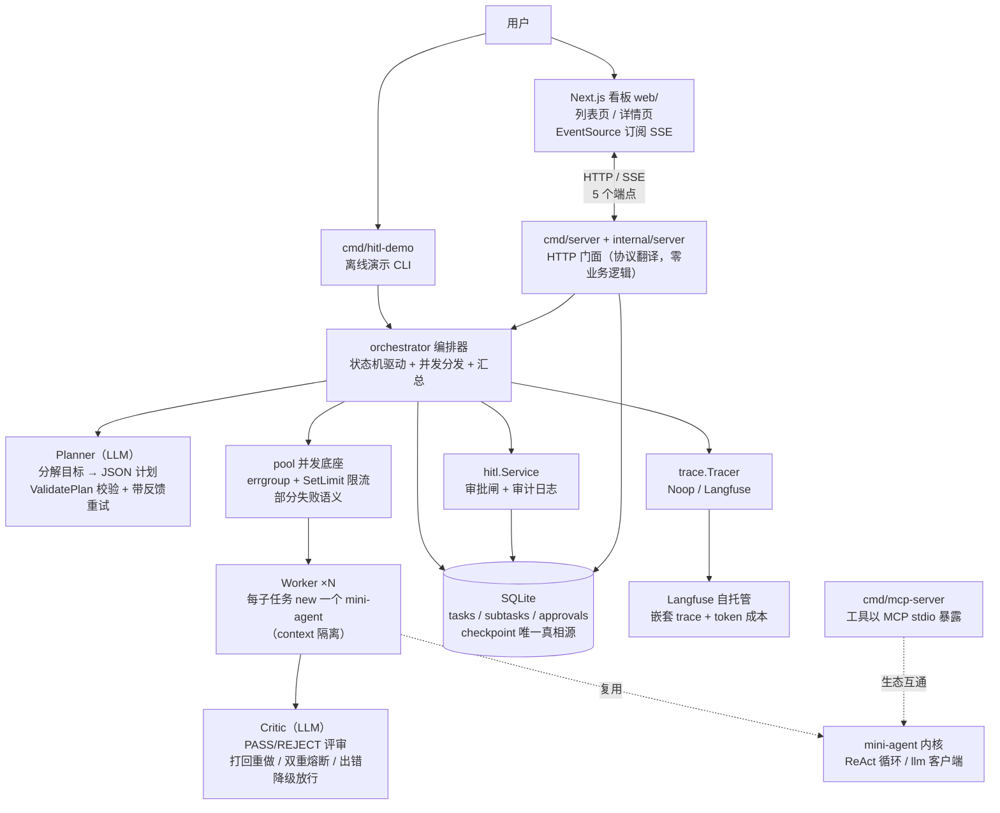
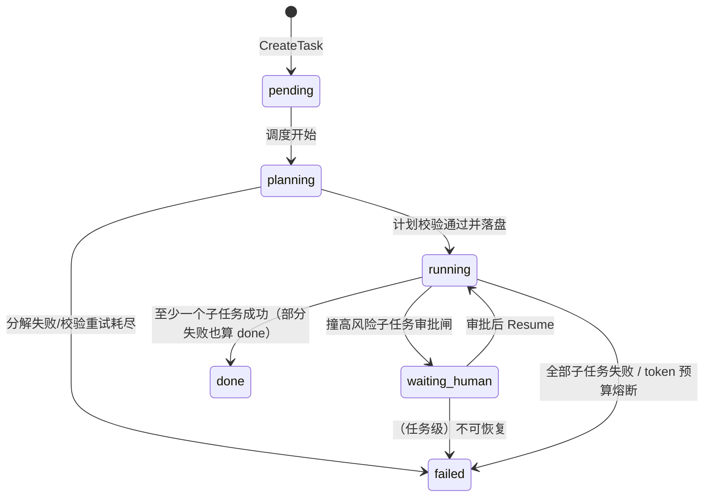

# 练习 9 参考答案：架构文档 + 故障演练报告

> 对应 TODO：`stage-03-multi-agent/docs/README.md` 的 `TODO(练习9)`。
> **完成练习并自评后再看本文档。**
>
> 本文档是文档型练习的参考答案，结构按 AGENTS.md 三节约定变通为：
> 一、architecture.md 示范；二、failure-drills.md 示范；三、关键设计点 / 评分对照清单。
>
> **一致性声明**：两份示范文档中描述的每个机制均来自练习1-8 的参考答案与
> `stage-03-multi-agent/` 代码骨架的包注释/TODO 契约，未虚构任何功能。
> HTTP/SSE API 与 Next.js 看板按练习8 已落地的真实设计描述
> （`internal/server` 五个 handler、`cmd/server` demo/真实双模式、`web/` 看板）。
>
> 示范文档中的"实际结果"取自各练习参考答案 2026-08-14 的验证记录
> （go test 通过记录、hitl-demo 管道实测摘要、cmd/server demo 模式 curl 实测），
> 你复跑时输出可能略有差异，以你自己的实测为准——文档型练习的评分标准是
> "真实、可复核"，不是与答案一致。
>
> **更新记录（2026-08-14）**：练习8（HTTP/SSE API + 看板）落地后同步更新——
> 架构示范的系统总览、SSE 取舍条目改为真实实现描述；演练1/2 补充基于
> `cmd/server` demo 模式的 HTTP 路径，实际结果引用练习8 答案的 curl 实测记录。

---

## 一、architecture.md 示范

> 以下是 `stage-03-multi-agent/docs/architecture.md` 的示范全文。

---

# 项目 3 架构文档：多 Agent 任务编排系统

## 0. 一句话与量化结果

一个**可恢复、可观测、可与人协作**的多 Agent 任务系统：用户通过看板或 API
提交一个目标，planner 把它分解成子任务，worker pool 并发执行（每个子任务是
一个独立的 mini-agent 实例），critic 对产出做评审打回，高风险子任务暂停等
人工审批，全程状态落 SQLite、trace 上报 Langfuse，看板经 SSE 实时看到进度。

量化结果（全部来自离线确定性测试与演练实测，非估算）：

- 引擎与 API 各模块离线测试全绿（pool 4 + task 5 + orchestrator 14 + hitl 4 +
  trace 5 + server 3，共 35 个；并发相关包均 `go test -race` 无数据竞争），
  覆盖并发上限、超时、部分失败、状态机非法迁移、崩溃恢复、评审循环、
  双重熔断、审批全流程、trace 上报格式、HTTP 全链路与 SSE 推送；
- 崩溃恢复实测：任务跑到一半 kill 进程，重启后已完成子任务**零重复执行**，
  被打断的子任务按幂等键重跑（详见 failure-drills.md 演练1）；
- 成本可核算到子任务：每个子任务的 token 消耗随 checkpoint 落盘，
  任务级总账 `tasks.total_tokens` 支撑预算熔断与看板成本栏——demo 模式
  curl 实测全链路总账 126 tokens（3 子任务 × 42）与详情接口逐子任务账一致；
- LLM 输出不可靠路径有确定性兜底：planner 计划 100% 过 schema 校验才进状态机，
  校验失败带反馈重试上限 2 次，耗尽则任务 failed（演练5 实测拦截）。

## 1. 系统总览



数据流自上而下（目标 → 计划 → 子任务 → 产出 → 汇总）；控制流的关键拐点
（每次状态迁移、审批决定）都同步写 SQLite——图里所有指向 DB 的箭头都是
一次 checkpoint 落盘。

HTTP/SSE 层（练习8）的三个设计要点：

- **只做协议翻译，零业务逻辑**：`internal/server` 把 HTTP 请求翻译成编排引擎
  的方法调用，状态机、审批闸、熔断全部在内层包里——换 CLI/gRPC 前端时
  内层一行不动。五个端点：`POST /api/tasks`（提交）、`GET /api/tasks`
  （列表）、`GET /api/tasks/{id}`（详情）、`POST /api/tasks/{id}/approve`
  （审批）、`GET /api/tasks/{id}/events`（SSE 事件流）。
- **HTTP 只接单，长任务放后台 goroutine**：Run/Resume 是分钟级长任务，
  同步等待意味着请求挂几分钟（浏览器/网关超时、连接占满）。提交与审批接口
  把长任务丢进后台 goroutine 立即返回（202/200），进度靠 GET 与 SSE 查。
  关键坑：goroutine 的 ctx 必须用 `context.Background()` 而不是
  `r.Context()`——响应一返回后者就被取消，任务刚起步就被掐死。
- **cmd/server 双模式**：未设 `DEEPSEEK_API_KEY` 走 demo 模式（固定三步计划
  的假 Planner + 延时回显的假 Worker），演示零成本、零网络依赖、结果可预期；
  设了 key 走真实模式（LLMPlanner + AgentWorker）。这是 Planner/Worker
  接口注入（练习3）的系统级红利——"换实现"从测试技巧变成了产品功能。

## 2. 为什么这样拆 agent

**先泼冷水：能单 agent 就别多 agent。** 多 agent 是用"状态一致性 + 成本 +
调试复杂度"换"单一职责 + 可控 context"，是 trade-off 不是升级。判断顺序：
先 prompt，再工具，再 workflow，最后才 multi-agent。

本系统撞到了三面墙中的两面，所以拆：

1. **context 膨胀**：一个长任务（如"调研三个方案写对比报告"）的所有中间结果
   堆在单 agent 的对话历史里，噪声稀释注意力。落地对策：每个子任务 new 一个
   独立 mini-agent 实例，只背自己的 system prompt + 自包含的子任务 prompt，
   跑完即弃（`AgentWorker.Execute`）。
2. **职责混杂**：规划（分解任务）、执行（跑子任务）、评审（把关质量）是三种
   不同的 prompt 职责，塞进一个 system prompt 会互相稀释。落地对策：
   planner / worker / critic 三个角色各自独立 prompt、独立可调模型。

**为什么是 planner-worker + critic 叠加，而不是 handoff 或 swarm**：

- 子任务**可并行**（"调研 A/B/C 三个方案"）→ 分解-并行-汇总的 planner-worker
  是天然匹配；handoff 是串行接力（路由/分诊场景），子任务之间没有
  "并行"这个需求点，用它等于放弃并发收益；
- 产出质量可自动检查（报告/文案类）→ critic 叠加在 worker 产出之后，
  生成-评审-打回循环，轮次与 token 双熔断防无限烧钱；
- swarm/群聊无固定拓扑、终止条件难设计、token 随 agent 数 × 轮数爆炸，
  生产可控性差，明确不用。

## 3. 状态机与 checkpoint 设计

设计核心一句话：**状态外置，进程无状态**——阶段一"对话历史即状态"在系统层
的放大。进程不持有任何不可丢失的东西，全部真相在 SQLite。



- **每步落盘**：CreateTask、每次 Transition、SaveSubtasks（计划落盘）、
  每个子任务的 Complete/Fail——状态机每迁移一次就持久化一次。崩溃恢复
  没有"快照间隔"问题，损失上限是"当前正在跑的那一个子任务"。
- **状态机守卫**：合法迁移用两张表（任务级/子任务级）显式声明，非法迁移
  直接报错——如子任务 `running → pending` 这条边是崩溃恢复测试逼出来的：
  重启后发现停在 running 的子任务，执行体已随进程死亡，必须先迁回 pending
  再重跑。
- **幂等键**：`taskID + ":" + 子任务ID`。两个兑现点：① 恢复分发时跳过
  done 子任务；② `CompleteSubtask` 发现已是 done 直接返回且不重复累加
  token——"恢复逻辑判跳过 + 写路径防双写"双保险。重试与崩溃恢复共用
  这一个机制（重试的前提永远是幂等）。
- **崩溃恢复流程**：重启 → `ListResumable` 找非终态任务 → `LoadTask` 读
  checkpoint → done 跳过、running/failed 迁回 pending 重排队、
  waiting_human 恢复审批等待 → 续跑。**汇总以 checkpoint 为准**（重新
  LoadTask 再拼），不看本轮内存结果——部分产出可能是上一个进程写的。
  cmd/server 启动时就执行这个流程（ListResumable 逐个后台 Resume），
  服务进程重启未完成任务自动续上。

## 4. 失败处理

失败四件套 + LLM 输出校验，逐条落点：

| 机制 | 本系统落点 |
| --- | --- |
| 重试 | 传输层：mini-agent `ChatWithRetry` 指数退避处理 429/5xx；内容层：planner 校验失败带错误反馈重试（上限 2 次，两条路径不混用，避免双重退避） |
| 幂等 | 幂等键 + CompleteSubtask 判重（见第 3 节），重试/恢复共用 |
| 降级 | critic 出错放行本次产出（记 log），连续出错 2 次整个任务跳过评审——critic 是质量增强不是单点故障；critic 输出无法解析也走降级而非误判 reject |
| 死信 | 子任务评审轮次耗尽 → FailSubtask 进 failed，不拖垮任务；最终汇总报告里呈现失败原因 |

**LLM 输出校验**（模型负责生成，代码负责把关）：planner 的 JSON 计划必须过
`ValidatePlan` 确定性校验（非空、≤8 个子任务、ID 唯一、字段非空白）才落盘
进状态机；解析侧对 ```` ```json ```` 围栏容错（取第一个 `{` 到最后一个 `}`）。
任何进状态机的 LLM 输出都先过代码校验，系统正确性不押在模型运气上。

**HITL 审批**：`RequiresApproval` 的子任务在执行前被审批闸拦下（迁
waiting_human，不占 goroutine、不算一次执行——demo curl 实测 s2 等批时
`attempts: 0`），编排器返回哨兵错误 `ErrWaitingHuman` 让出；人工决定经
`hitl.Service.Decide` 落盘（approve = 一次性放行令牌：清 requires_approval
旗标 + 回 pending；reject = 子任务 failed 且不重排队）+ approvals 审计表
留名留时（HTTP 层对空 by 返回 400）。流程状态的唯一真相源是
`subtask.status`，审计表不参与流程判断（防双写不一致）。HTTP 审批接口在
"任务所有待批项都批完"时才后台触发 Resume——批一个就 Resume 一次会撞上
剩余审批闸立刻又让出，无害但浪费。

## 5. 并发设计

- **errgroup + SetLimit 当 semaphore**：worker pool 并发度钉在上限内，
  限流限在源头（429 的代价高于排队）。刻意用裸 `errgroup.Group` 而非
  `WithContext`：后者任一 goroutine 出错会取消派生 ctx（"一错全停"），
  与本系统要的**部分失败语义**相反——三个调研子任务挂了一个，另外两个的
  结论仍要进汇总。每个 goroutine 把 error 收进自己下标的 `Result.Err` 后
  return nil，error 绝不逃出 goroutine。
- **结果收集**：预分配切片按 jobs 下标写回，disjoint 写入无锁、顺序天然一致，
  不需要 fan-in channel。
- **context 预算分层**：任务总预算（上层 ctx）> pool 单 job 超时
  （`WithTimeout` 派生）> 单次 LLM 调用（mini-agent http.Client.Timeout
  120s 兜底）。越下层预算越小，上层留余量做 checkpoint 与善后——全局一个
  死线的话，到点所有层一起死，连记录失败状态的机会都没有。已知缺口：
  mini-agent 的 `llm.Client.Chat` 不接收 ctx，LLM 调用层超时靠 http.Client
  兜底，编排层 ctx 取消在调用间隙生效。
- **HTTP 层的 ctx 纪律**（练习8 补的一层）：后台长任务用
  `context.Background()`（不能随请求取消）；读路径（list/get/SSE 单次查询）
  用 `r.Context()`——客户端断开时查询没必要继续，SSE 循环也靠
  `r.Context().Done()` 退出。

## 6. 成本设计

- **token 核算到子任务**：worker 执行完读 `Agent.Usage().TotalTokens`（整趟
  ReAct 的累计量），随 `CompleteSubtask` 落盘并累加进 `tasks.total_tokens`
  ——崩溃恢复后总账从 checkpoint 续算，不丢账。看板详情页直接展示每个
  子任务的 tokens_used 与任务总账（demo curl 实测：3 子任务 × 42 =
  total_tokens 126，账实相符）。
- **双重熔断**（缺一不可）：① 轮次熔断——单子任务评审打回达 `maxCriticRounds`
  仍未通过 → 该子任务 failed；② 预算熔断——任务累计 token（worker + critic，
  含恢复前已烧的）超 `tokenBudget` → 哨兵错误 `ErrBudgetExceeded`，任务直接
  failed。防的就是 critic 打回循环这种"合法但烧钱"的失控。
- **模型分级**：Planner / Worker / Critic 都是接口注入，planner/critic 可配
  强模型、worker 配便宜模型，换实现不换编排器。
- **砍 context**：worker 只拿自包含的子任务 prompt，不背全局历史（第 2 节）。
- 参考单价（DeepSeek，$/1M tokens，简化按缓存未命中计）：deepseek-chat
  input 0.27 / output 1.10；deepseek-reasoner input 0.55 / output 2.19。

## 7. 可观测

- **trace/span 层级 = agent 层级**：一次任务一个 trace（根 span）→ planner
  一个子 span → 每个子任务一个 span →（练习6 落地后）每次 LLM 调用一个
  generation。排查下钻顺序：任务 → 子任务 → 单次调用。
- **Tracer 是接口**：编排器只依赖 `trace.Tracer`，本地/单测用 Noop（零开销），
  接 Langfuse 只换实现，编排器一行不改。Langfuse 实现走公开 ingestion API
  批量上报，span 嵌套用 `parentObservationId` 表达，成本按单价表客户端算好
  随事件上报；StartSpan/EndSpan 只攒 buffer、Flush 一次性发，上报失败不影响
  主流程。
- **看板是"给人看"的实时观测面**：SSE 推送 poll-diff 快照（详见局限 2 的
  取舍），帧内容就是任务详情视图——状态、子任务进度、token 账一帧全有；
  实测可见 `running → waiting_human → done` 的逐帧流转。
- 成本数据驱动优化：哪个子任务最贵、critic 打回烧了多少钱，都从 trace /
  checkpoint 的 token 账里出，没有观测就没有成本控制。

## 8. 取舍与已知局限（诚实清单）

1. **同步编排 vs 事件驱动**：编排器主动推进状态机（Run/Resume 一气跑完），
   不是事件驱动架构。取舍：简单、可调试、链路显式；代价是弹性与解耦不如
   事件流。本规模下同步是对的，上量后事件驱动是演进方向。
2. **SSE 用 poll-diff 而不是 orchestrator 事件 hook**（练习8 的实际选择）：
   每秒读一次 checkpoint 快照，JSON 变了才推一帧，15s 注释行心跳保活
   （防反向代理掐空闲连接），任务终态后不主动断连（EventSource 自动重连
   会反复刷同样的终态快照）。取舍：① 零侵入——orchestrator/task/hitl 的
   契约一行不改；② **跨进程正确**——checkpoint 在 SQLite 里，approve 这类
   由 HTTP 进程发起的迁移，事件 hook（只活在跑编排器的进程里）根本收不到，
   poll 读库天然正确，这是"状态外置"红利的又一次兑现。代价：≤1s 延迟 +
   每连接每秒一次 SQLite 读。看板是给人看的场景，秒级足够；hook 是性能
   瓶颈真的出现后的优化方向。
3. **SQLite 单机边界**：单写者模型（`SetMaxOpenConns(1)` 串行化 + busy_timeout），
   单进程单机的学习/小团队规模够用；多实例部署、高并发写、跨机看板查询
   就要换 Postgres（hitl 与 task 的 SQL 都是标准查询，迁移成本低）。
   hitl 与 server 各自对同一文件建连接是已知妥协（关注点分离的代价：
   读连接/审计连接与 Store 契约分离，纪律是"状态修改只走 Store/Service 的
   状态机守卫，绝不直接 SQL 改状态"）。
4. **SaveSubtasks 基础版非事务**：崩溃恰好发生在计划落盘写一半时，恢复后会
   以"已落盘的部分计划"继续跑而不重新分解。事务版（SaveSubtasksTx）已在
   练习2 进阶实现中验证，基础版如实保留此边界。
5. **LLM 调用层超时不接 ctx**：mini-agent `llm.Client.Chat` 无 ctx 参数，
   单次调用超时靠 http.Client.Timeout 120s 兜底——预算分层在最深一环是
   "客户端超时"而非"context 级联"，内核改造是后续项。
6. **汇总用确定性拼接而非 LLM 汇总**：省一轮 token、格式可控、少一个失败点；
   代价是汇总没有"智能整合"，产品化阶段可按需叠加 LLM 汇总层。
7. **HTTP 层无鉴权、CORS 全开**：`Access-Control-Allow-Origin: *` 是本地学习
   的最宽配置，审批接口也没有登录态（by 是请求体里自报的字符串）。上生产前
   要补鉴权与 CORS 收紧——审计"留名"才有意义。

---

## 二、failure-drills.md 示范

> 以下是 `stage-03-multi-agent/docs/failure-drills.md` 的示范全文。
> 演练环境：练习1-8 已完成（编排引擎 + HTTP API 可真实跑通）；所有命令在
> `stage-03-multi-agent/` 目录下执行。每个演练给出"自动化路径（go test，
> 确定性）+ 手动路径（hitl-demo CLI 或 cmd/server demo 模式 + curl，
> 可操作感）"，跑任一条即可，多条都跑更好。

---

# 故障演练报告：多 Agent 任务编排系统

演练日期：____（填写你实际跑的日期）
演练原则：**把架构文档里的每一条容错声明变成一条实测记录**。

## 演练 1：崩溃恢复——kill 进程后重启续跑

**目的**：验证"状态外置 + 每步落盘"声明——进程任意时刻死亡，重启后任务
从 checkpoint 续跑，已完成子任务不重复执行（幂等键生效）。

**步骤 A（自动化，确定性）**：

```bash
go test ./internal/task/ -run TestCrashRecovery -count=1 -v
go test ./internal/orchestrator/ -run TestResume_SkipsDoneSubtasks -count=1 -v
```

**步骤 B（手动，hitl-demo 真实进程）**：

```bash
go build -o /tmp/hitl-demo ./cmd/hitl-demo
printf 'a\n' | /tmp/hitl-demo --db /tmp/drill1.db   # 先完整跑一遍确认正常
rm /tmp/drill1.db
/tmp/hitl-demo --db /tmp/drill1.db   # 在出现"批准执行？(a/r)"提示时直接 Ctrl-C 杀掉
sqlite3 /tmp/drill1.db "SELECT id,status FROM tasks; SELECT id,status,requires_approval FROM subtasks;"
printf 'a\n' | /tmp/hitl-demo --db /tmp/drill1.db   # 同一条命令重启
```

**步骤 C（手动，cmd/server demo 模式——HTTP 服务形态）**：

```bash
env -u DEEPSEEK_API_KEY go run ./cmd/server --addr :18080 --db /tmp/drill1s.db &
sleep 1
curl -X POST localhost:18080/api/tasks -d '{"goal":"写一份数据治理周报"}'   # 拿 task_id
sleep 2 && kill %1                            # 任务跑到一半杀服务进程
sqlite3 /tmp/drill1s.db "SELECT id,status FROM subtasks;"   # 看崩溃现场
env -u DEEPSEEK_API_KEY go run ./cmd/server --addr :18080 --db /tmp/drill1s.db
# 启动日志应出现"发现未完成任务 ...，从 checkpoint 续跑"（main 启动时 ListResumable 逐个 Resume）
curl localhost:18080/api/tasks/<task_id>      # 已 done 的子任务不重跑，任务继续推进
```

**预期**：① 崩溃现场落盘——已完成的子任务 done、正在跑的停 running、
未开始的 pending（或审批点 waiting_human）；② 重启后从 checkpoint 续跑；
③ 已 done 的子任务**零重复执行**（看 attempts 与产出）；④ 被打断的子任务
迁回 pending 重跑（attempts +1）；⑤ hitl-demo 路径中任务停 waiting_human
时，审批后 s2 执行，任务 done，approvals 表留记录。

**实际结果**：

- 自动化（练习3 参考答案 2026-08-14 验证记录）：两个测试通过。
  `TestResume_SkipsDoneSubtasks` 断言：s1（已 done）worker 零调用，
  s2（停 running 的崩溃现场）/s3（pending）各执行一次，汇总含 s1 从
  checkpoint 读出的产出，s2 的 Attempts=2（被打断 1 次 + 重跑 1 次），
  任务最终 done，planner 全程未被调用（不重新分解）。
- 手动 hitl-demo（练习5 参考答案 2026-08-14 管道实测）：崩溃后 sqlite3
  查询可见 `demo-task|waiting_human`、`s1|done|0`、`s2|waiting_human|1`、
  `s3|done|0`；重启续跑后任务 done，s2 只执行一次，approvals 表留下
  `s2|demo-user|1`。
- 手动 cmd/server 路径：**本参考答案写作时未实测**——cmd/server 的
  启动续跑代码（main 里的 ListResumable → Resume）由骨架提供、练习8 验证
  记录未覆盖 kill-restart 场景。该路径的预期行为有 hitl-demo 实测与
  orchestrator 恢复测试双重间接背书（同一套 Resume 机制），但请你自行跑
  一遍并把自己的输出填在这里——这正是本演练要你亲手补的记录。

**结论**：崩溃恢复声明成立（CLI 形态实测 + 自动化测试双背书；HTTP 服务
形态待你补实测）。损失上限 = 当前正在跑的一个子任务（其 Attempts +1 后
重跑）；已完成工作的 token 与产出零损失。已知边界：崩溃若恰好落在
SaveSubtasks 写一半（基础版非事务），会以部分计划续跑（架构文档局限 4）。

## 演练 2：人工审批——approve / reject 两路径

**目的**：验证 HITL"暂停-恢复"声明——高风险子任务不占 goroutine 地等待
人工决定；approve 是一次性放行令牌（恢复后审批闸不再拦截）；reject 是
终局决定（不重排队）；审批决定本身也落盘，进程重启不丢。

**步骤 A（自动化）**：

```bash
go test ./internal/hitl/ -count=1 -v          # approve 续跑 / reject 不重排队 / Decide 后崩溃重建再 Resume
go test ./internal/server/ -count=1 -v        # HTTP 全链路：提交→waiting_human→approve→done，含 400/409 校验
```

**步骤 B（手动 CLI，hitl-demo）**：

```bash
printf 'a\n' | go run ./cmd/hitl-demo --db /tmp/drill2a.db   # approve 路径
printf 'r\n' | go run ./cmd/hitl-demo --db /tmp/drill2r.db   # reject 路径
```

**步骤 C（手动 HTTP，cmd/server demo 模式 + curl）**：

```bash
env -u DEEPSEEK_API_KEY go run ./cmd/server --addr :18080 --db /tmp/drill2.db &
curl -X POST localhost:18080/api/tasks -d '{"goal":"写一份数据治理周报"}'
sleep 4 && curl localhost:18080/api/tasks/<task_id>        # 应见 waiting_human，s2 attempts=0
curl -N localhost:18080/api/tasks/<task_id>/events          # 另开终端：SSE 逐帧推状态变化
curl -X POST localhost:18080/api/tasks/<task_id>/approve \
  -d '{"subtask_id":"s2","approved":true,"by":"curl-tester"}'
sleep 3 && curl localhost:18080/api/tasks/<task_id>        # 应见 done，s2 attempts=1
# reject 路径：换个新任务，approve 时传 "approved":false
```

**预期**：approve——s2（删除过期数据，RequiresApproval）先停
waiting_human 且 attempts=0（审批闸拦在执行前，不算一次执行），批准后
Resume 续跑，s2 真实执行恰好一次，任务 done，恢复后审批闸不再拦截
（令牌已消费）。reject——s2 置 failed，Output 记"已被人工驳回"，任务按
部分失败语义 done，s2 不被重排队。HTTP 层：提交返回 202；空 by 返回 400
（审计必须留名）；对不在等批的子任务做决定返回 409。

**实际结果**：

- 自动化（练习8 参考答案 2026-08-14 验证记录）：`go test ./internal/server/`
  3 个测试全过（含 `-race`）。`TestHTTPLifecycle` 断言：approve 前 s2
  worker 零调用（审批闸生效）、approve 后 s2 恰好执行 1 次、任务 done、
  TotalTokens 账实相符；`TestApprove_Validation` 断言空 by → 400、审批
  已 done 子任务 → 409。
- 手动 hitl-demo（练习5 参考答案 2026-08-14 管道实测）：approve 路径三个
  子任务全部 done，汇总含 s2 产出；reject 路径任务 done，汇总呈现
  `[s2] 删除过期数据（未完成：已被人工驳回（审批人：demo-user））`，s1/s3
  正常产出；`TestCrashAfterDecide_ApprovalSurvivesRestart` 通过——
  Decide(approve) 后关掉全部连接、重建再 Resume，"已批未执行"的决定从
  SQLite 恢复，任务续跑完成。
- 手动 HTTP（练习8 参考答案 2026-08-14 demo 模式 curl 实测）：POST 提交
  返回 202 与 task_id；约 4s 后任务 `waiting_human`，s1/s3 `done`
  （各 42 tokens），s2 `waiting_human` 且 `attempts: 0`；`curl -N` 订
  阅 events 立即收到首帧快照，任务边跑边收到
  `frame1: task=running subtasks=[running, waiting_human, running]` →
  `frame2: task=waiting_human subtasks=[done, waiting_human, done]`
  （有变化才推，无变化连接安静）；approve 返回 `{"ok":true}`，约 3s 后
  任务 `done`，s2 `attempts: 1`，`total_tokens: 126`（3×42）。

**结论**：审批点声明成立，且在 CLI 与 HTTP 两种前端形态下行为一致
（同一套 Decide + Resume 机制）。"暂停"是状态落盘后的进程让出而非内存
阻塞，所以审批人可以从容决定（甚至隔天），系统侧零资源占用。审计留名
留时（hitl 层拒绝空审批人，HTTP 层 400 兜底）。**如实备注**：浏览器侧
EventSource 实时刷新与审批按钮点击未做自动化验证（练习8 验证记录说明：
无浏览器环境），运行时行为靠上述 SSE/审批 curl 实测间接背书。

## 演练 3：限流与部分失败——worker 挂了不拖垮整批

**目的**：验证两条声明：① pool 并发度钉在上限内（semaphore 限流限在源头）；
② 部分失败语义——单个 worker 失败/超时收进该子任务的结果与 checkpoint，
其余子任务照常，任务整体按"有成功即 done"汇总，失败原因进汇总报告。

**步骤（自动化）**：

```bash
go test ./internal/pool/ -count=1 -v
go test ./internal/orchestrator/ -run 'TestRun_PartialFailureStillSummarizes|TestRun_AllSubtasksFail_TaskFails' -count=1 -v
```

**预期**：pool 层——`TestRun_RespectsConcurrencyLimit` 用计数器证明任意时刻
在跑的 job 数 ≤ maxConcurrent；`TestRun_JobTimeout` 证明单 job 超时被
context 预算切断；`TestRun_PartialFailure` 证明失败 job 的 Err 落在对应
下标、成功 job 不受影响、结果顺序与 jobs 一致。编排层——s2 注入失败时任务
仍 done，汇总同时含 s1/s3 产出与 s2 的失败原因；全部子任务失败时任务
failed。

**实际结果**：全部通过（练习1/3 参考答案验证记录：pool 4 个测试 +
orchestrator 9 个测试，`-race` 无数据竞争）。汇总文本形态：
`## [s2] 写稿（未完成：LLM 超时）` 与成功子任务产出并列。

**结论**：声明成立。部分失败语义是刻意选择（裸 errgroup.Group + error 收进
结果值），不是 errgroup 默认行为——如果误用 `errgroup.WithContext`，
一个子任务失败会级联取消其余 worker，本演练会直接暴露这个错误。

## 演练 4：预算熔断——token 耗尽任务 failed

**目的**：验证成本控制声明——critic 打回循环这类"合法但烧钱"的失控被
任务级 token 预算硬性截断：累计消耗（worker + critic，含崩溃恢复前已烧的）
超预算，任务直接 failed。

**步骤（自动化）**：

```bash
go test ./internal/orchestrator/ -run 'TestTokenBudgetBreaker|TestCriticLoop_RoundBreaker' -count=1 -v
```

**预期**：`TestTokenBudgetBreaker`——注入每次调用固定消耗 token 的假
worker/critic，设一个小于"跑完全部子任务所需"的预算，断言：预算检查点在
每次 LLM 调用之前触发，返回哨兵错误 `ErrBudgetExceeded`，任务迁 failed，
已烧 token 账与 checkpoint 一致。`TestCriticLoop_RoundBreaker`——critic
永远 reject 时，单子任务执行达 `maxCriticRounds` 即熔断为该子任务 failed
（错误信息注明评审熔断），不是无限循环。

**实际结果**：通过（练习4 参考答案验证记录：14 个测试含本轮次/预算两条
熔断路径，`-race` 无数据竞争——并发子任务共享的 token 计数器用 atomic）。

**结论**：双重熔断声明成立。轮次熔断管"单点死循环"，预算熔断管"总量失控"，
缺一不可：只有轮次熔断挡不住"每个子任务都在上限内但总账爆炸"，只有预算
熔断则单子任务就能烧完全部预算。

## 演练 5：planner 输出非法 JSON——校验拦截 + 带反馈重试

**目的**：验证"模型负责生成，代码负责把关"声明——LLM 输出的计划不过
ValidatePlan 确定性校验就绝不可能进状态机；校验失败带具体错误反馈重试
（限次），耗尽则任务 failed，系统正确性不押在模型运气上。

**步骤（自动化）**：

```bash
go test ./internal/orchestrator/ -run 'TestValidatePlan|TestLLMPlanner|TestRun_PlannerFailureFailsTask' -count=1 -v
```

**预期**：`TestValidatePlan` 表驱动五类——空计划、超上限（>8）、重复 ID、
空字段、合法计划，前四类全部拦截且错误信息带定位（subtasks[i]）。
`TestLLMPlanner_RetriesAfterInvalidOutput`——第一次返回非 JSON 垃圾文本，
第二次请求的 messages 里必须带"你输出的计划未通过校验：<err>"的反馈，
重试后合法计划通过。`TestLLMPlanner_ToleratesCodeFence`——
```` ```json ```` 围栏包裹的输出也能解析。`TestLLMPlanner_RetryExhausted`
——持续输出垃圾时，chat 共调用 3 次（1 首发 + 2 重试）后报错，上层把任务
迁 failed（`TestRun_PlannerFailureFailsTask` 覆盖 planning→failed 迁移）。

**实际结果**：全部通过（练习3 参考答案验证记录）。

**结论**：声明成立。注意分层：LLM 调用本身失败（网络/限流）由内层
ChatWithRetry 退避处理，Plan 层只重试"内容不合法"——两类错误走两条重试
路径，不混用（混用会造成双重退避）。

## 演练总结

| 容错声明（架构文档） | 演练 | 结果 |
| --- | --- | --- |
| 崩溃恢复零重复执行 | 1 | ✅ 实测成立（CLI 形态 + 自动化）；HTTP 服务形态待补实测 |
| HITL 暂停-恢复 + 一次性放行 + 审计 | 2 | ✅ 实测成立（CLI + HTTP 双形态） |
| 并发限流 + 部分失败汇总 | 3 | ✅ 实测成立 |
| 双重熔断防烧钱 | 4 | ✅ 实测成立 |
| LLM 输出校验兜底 | 5 | ✅ 实测成立 |
| HTTP 只接单 + SSE poll-diff 实时推送 | 2（HTTP 路径） | ✅ 实测成立（curl）；浏览器侧未自动化验证 |

未覆盖/后续演练方向（诚实清单）：

- cmd/server 的 kill-restart 续跑（演练1 步骤 C）——机制与 hitl-demo 同源
  但 HTTP 形态未实测，补上它演练1 才算双形态闭环；
- 真实 LLM API 冒烟：cmd/server 真实模式（设 `DEEPSEEK_API_KEY`）跑一个
  任务，验证 LLMPlanner/AgentWorker 接真实模型、429 退避真实生效、
  Langfuse 出现真实 trace 与成本数字；
- 浏览器端演练：看板 EventSource 实时刷新与审批按钮的点击路径（练习8
  只做了构建验证与联调 smoke）；
- Langfuse 上报失败的端到端演练："停掉 Langfuse 容器跑任务，主流程不受
  影响"（练习6 测试已覆盖上报错误路径，缺一次真实端到端）。

---

## 三、关键设计点 / 评分对照清单

### 关键设计点（写这两份文档时的方法论）

1. **"问题 → 架构 → 量化结果"是简历口径，也是自检口径**。每个架构决策先写
   它解决什么问题（context 膨胀、状态丢失、成本失控），再写方案，最后给
   量化证据。量化不许编造：本项目现阶段最硬的量化就是"35 个离线测试 +
   -race 无竞争 + 演练实测记录（含 demo 模式 curl 全链路数字）"；真实 API
   的成本数字等真实模式冒烟后补。写不出量化证据的小节，往往就是没真做懂的
   小节。
2. **文档里的每个机制必须能指到代码**。示范文档中幂等键、审批闸、双熔断、
   chat 注入、poll-diff SSE、后台 goroutine ctx 纪律等表述全部对应练习1-8
   的具体实现；反过来，凡是只在教程里出现、代码里没有的机制（如事件驱动
   编排、事件 hook），只能出现在"局限与取舍"里，不能写成已有能力——把规划
   写成现状是文档型练习最常见的失分点。
3. **演练报告的价值在"实际结果"一栏**。只写"符合预期"等于没演练。合格的
   实际结果 = 关键输出摘要（状态迁移序列、sqlite3 查询结果、curl 响应、
   测试断言要点），标准是"没跑过的人能据此复核"。没跑过的路径就写"未实测"
   并说明间接背书（如本示范演练1 的 server 路径）——诚实标注比补一个
   漂亮数字值钱得多。与预期不符时如实记录并分析，比满分通过更有面试价值。
4. **已知边界写进结论，不写进免责声明**。SaveSubtasks 非事务边界、
   llm.Client 不接 ctx、SQLite 单机限制、HTTP 无鉴权——这些在示范文档里
   都给了"触发条件 + 影响 + 演进方向"三要素。知道边界在哪比假装没有边界
   更值钱。
5. **示范与答案的差异是允许的**。两份示范是"达标线以上"的样本，不是唯一
   正确形态：小节顺序、措辞、图的画法都可以不同，按下面的对照清单自评即可。

### 对照清单

**架构文档自评（8 条，全部打勾算达标）**：

- [ ] 有一张系统总览图，且图中每个节点/箭头都能对应到真实代码（HTTP/SSE
  层、看板按练习8 的真实实现描述：五个端点、后台 goroutine、poll-diff）；
- [ ] "为什么拆 agent"先讲"能单 agent 就别多 agent"与三个撞墙信号，再说清
  为什么 planner-worker + critic 而不是 handoff/swarm，且理由落在"子任务
  可并行 / 产出可自动评审"这两个本项目的真实特征上；
- [ ] 状态机有图、讲清每次 checkpoint 落盘的时机与内容、幂等键的两个兑现点
  （恢复跳过 + 写路径防双写）、崩溃恢复的完整流程（ListResumable → LoadTask
  → 分类处置 → 续跑）；
- [ ] 失败处理能逐条指到代码：传输层重试与内容层重试分层、critic 降级放行、
  死信（轮次熔断 failed）、planner 计划过 ValidatePlan 才进状态机；
- [ ] 并发设计讲清三件事：为什么用裸 errgroup 而非 WithContext（部分失败
  语义）、SetLimit 限流限在源头的理由、context 预算分层（含"全局一个死线"
  的反面论证，以及 HTTP 层"后台任务用 Background、读路径用 r.Context()"
  的纪律）；
- [ ] 成本设计含：token 核算到子任务的链路（Usage → CompleteSubtask →
  total_tokens）、双重熔断缺一不可的论证、模型分级靠接口注入；
- [ ] 可观测讲清 span 层级 = agent 层级、Tracer 接口解耦（Noop 默认）、
  成本数据从哪来（含看板/SSE 这条"给人看"的观测面）；
- [ ] 有诚实的"取舍与已知局限"一节，至少覆盖：同步编排 vs 事件驱动、
  SSE poll-diff vs 事件 hook（含跨进程论据）、SQLite 单机边界，且每条局限
  给"触发条件 + 影响 + 演进方向"。

**演练报告自评（6 条，全部打勾算达标）**：

- [ ] 五个演练齐全，每个都是 目的/步骤/预期/实际结果/结论 五段结构；
- [ ] 每个演练的"步骤"是真实可跑的命令（`go test ./internal/... -run ...`、
  hitl-demo 管道命令、cmd/server demo 模式 + curl），交给没看过代码的人
  能照着跑通；
- [ ] "实际结果"不是"符合预期"四个字——贴了关键输出摘要（状态序列、
  汇总文本片段、curl 响应、断言要点），可复核；没跑过的路径如实标"未实测"
  并说明间接背书，不编造数字；
- [ ] 演练1 明确验证了"已完成子任务零重复执行"（不是只验证"任务能续跑"），
  并给出崩溃现场的状态证据（如 sqlite3 查询结果）；
- [ ] 演练2 同时覆盖 approve 与 reject 两路径，且讲清"一次性放行令牌"
  与"驳回不重排队"的语义；HTTP 形态的审批（202/400/409 语义）有实测记录；
- [ ] 有总结表把"架构文档的容错声明"与"演练结果"一一对应，并诚实列出
  未覆盖的场景与后续演练方向。
