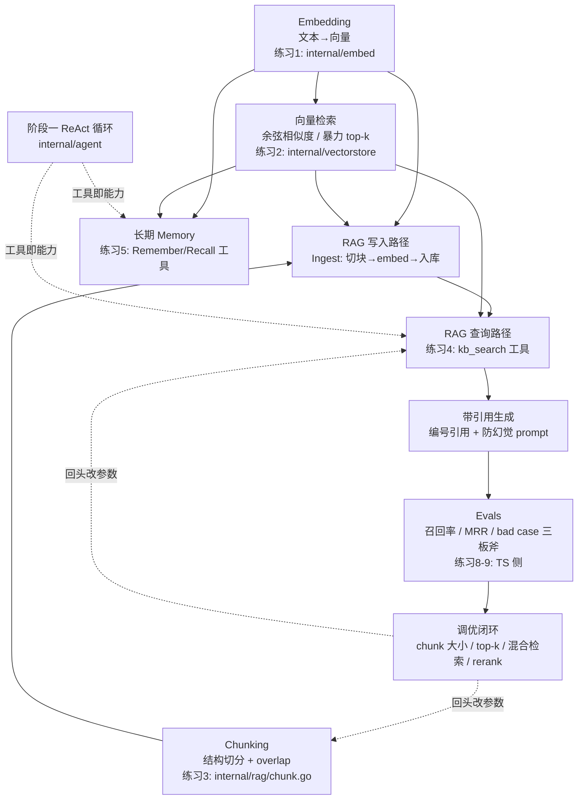

# 阶段二沉淀：进阶（RAG / Memory / Evals）

> 状态：🔄 进行中（第 5-10 周）
> 对应项目：Go 概念部分在 `mini-agent/` 上扩展；项目 2 为 `stage-02-kb-agent/`（TS 全栈，待创建）
> 前置阅读：`docs/stages/stage-01-foundations.md`（已验收）、`docs/embedding-vectordb-guide.md`、`docs/ROADMAP.md`

---

## 〇、本阶段的项目结构决策

- **Go 概念练习（embedding / 向量库 / RAG / Memory）**：不开新项目，直接在 `mini-agent/` 上新增独立 package（`internal/embed`、`internal/vectorstore`、`internal/rag` 等）。理由：复用阶段一的 `llm.Client`（含重试、流式）和 ReAct 循环，RAG 检索最终以"工具"形态接入 agent，正是知识拓扑图中 RAG 依赖 ReAct 的体现。
- **项目 2（全栈知识库 Agent）**：与 Go 代码零依赖，新建 `stage-02-kb-agent/`（Next.js + Vercel AI SDK）。命名带阶段前缀，表示这是阶段二的产出。

## 〇.五、阶段知识图谱



读法：实线 = 数据/依赖流向；虚线 = 反哺关系。左半（A/B/C/D/E/F）是 RAG 主线，G 是 Memory 支线（与 RAG 共享 embedding + 检索两大底座），H/I 是评估与调优闭环——Evals 不是最后一步，而是驱动前面所有环节改参数的依据。

## 一、这个阶段在学什么

把阶段一的"会对话的 agent"升级为"有知识、有记忆、可度量质量的 agent"：

1. **Embedding**：文本 → 向量，语义检索的数学基础（DeepSeek 无 embedding API，用硅基流动 bge-m3）。
2. **向量检索**：余弦相似度手写 → 理解 ANN/HNSW → 按需换 pgvector。
3. **RAG 全链路**：文档解析 → chunking → 入库 → 检索 → 带引用生成；重点是 bad case 分析。
4. **Memory**：短期会话记忆（阶段一已有雏形：历史即状态）→ 长期记忆（持久化 + 检索式回忆）。
5. **Evals**：给 RAG 建测试集，用数字说话（检索命中率、回答正确率），替代"感觉还行"。

## 二、核心概念（必须能脱稿讲出来）

### 1. RAG 的本质

LLM 上下文有限且知识有截止日期。RAG = **检索（Retrieval）+ 增强（Augmented）+ 生成（Generation）**：先从知识库找出与问题最相关的几段，塞进 prompt，让模型"开卷考试"。核心价值：知识可更新、答案有出处（可引用）、减少幻觉。

### 2. Embedding 与余弦相似度

- Embedding 模型把文本映射为固定维向量（bge-m3 为 1024 维），语义相近 → 向量距离近。
- 余弦相似度：`cos(a,b) = a·b / (|a||b|)`，只关心方向不关心长度，是文本检索的默认度量。
- **检索 = 暴力最近邻**：查询向量与库中每个向量算相似度，取 top-k。数据量小（<10 万）时纯内存暴力完全够用——先手写暴力版，再谈 HNSW。

### 3. Chunking 决定检索质量的上限

文档不能整篇入库（向量会"稀释"主题、超出 embedding 输入上限）。切分策略：

| 策略 | 做法 | 适用 |
| --- | --- | --- |
| 固定窗口 + overlap | 每 N 字符/token 切一刀，相邻块重叠 10-20% | 起步基线，防上下文在边界被切断 |
| 按结构切 | 按段落/标题/代码块边界切 | Markdown、文档类首选 |
| 语义切 | 按 embedding 变化点切 | 效果好但贵，了解即可 |

块太大 → 噪声多、相似度被稀释；块太小 → 上下文不完整、答案断章取义。**chunk 大小是 RAG 第一调参位**。

### 4. 混合检索与 rerank

- 向量检索（语义）与 BM25（关键词）互补：专有名词、错误码、人名等字面查询，向量检索反而弱。
- 混合检索 = 两路结果按规则（如 RRF 倒数排名融合）合并。
- rerank = 用专门模型对初检结果重排序，用成本换精度，放在"检索 → 生成"之间。

### 5. Memory：短期与长期

- 短期：会话内 messages（阶段一）；超限用压缩（练习 3 已做）。
- 长期：跨会话的事实/偏好，存外部存储（sqlite/pg），**回忆本质也是一次检索**——把"记住的东西"当知识库查。

### 6. Evals：没有度量就没有优化

RAG 调优靠 eval 驱动：建一批"问题 + 期望命中的文档/期望答案"测试集，跑 pipeline 量化：

- 检索侧：召回率（期望文档是否进 top-k）、MRR（第一个正确结果排第几）。
- 生成侧：答案正确性/忠实度（可用 LLM-as-judge，注意评判本身有偏）。

## 三、知识梳理（复习资料）

> 目标：只看本节，就能通过本阶段相关的面试提问。随学习推进持续补充。

### 3.1 自问自答考点清单

**Q1：为什么需要 RAG？直接用微调把知识灌进模型不行吗？**
三个原因：① 知识时效——微调后知识冻结，RAG 改库即更新；② 可追溯——RAG 能给出引用来源，微调是"黑盒记忆"；③ 成本与风险——微调贵且可能灾难性遗忘，RAG 不动模型本身。微调适合教"风格/格式/领域语感"，RAG 适合教"事实知识"，两者互补。

**Q2：Embedding 检索和关键词检索（BM25）各擅长什么？**
向量检索擅长语义改写（"怎么退款" 命中 "退货流程"），但对字面敏感的查询弱（错误码 `E-4021`、型号、人名、新词未入训练分布）。BM25 正相反。生产做法是混合检索 + 合并排序（RRF），重要场景再加 rerank。

**Q3：chunk 切多大？怎么验证切得好不好？**
没有银弹，常见起点 200-500 token + 10-20% overlap，按文档结构优先。验证方法：建检索测试集看 top-k 召回率；bad case 分析看"期望内容是否被切散在两个块里"（→ 加大 overlap 或按结构切）。

**Q4：检索不到正确文档（召回失败）怎么排查？**
三板斧之一。按链路逐段定位：① query 侧——用户问题太短/口语化，做 query 改写（让 LLM 把问题展开成检索友好形式）；② 索引侧——chunk 切坏、embedding 模型不适配领域；③ 度量侧——top-k 太小、相似度阈值太高、该用混合检索的只用了向量。

**Q5：检索到了但答非所问 / 编造，怎么办？**
三板斧后两板。答非所问：检查塞进 prompt 的 chunk 是否真相关（可能 top-k 混进噪声 → 加阈值或 rerank）、prompt 是否明确要求"仅基于给定资料回答"。编造：prompt 加"资料不足就说不知道"，生成侧 eval 加忠实度指标（答案是否被检索内容支持）。

**Q6：HNSW 是什么？什么时候需要它？**
HNSW（分层可导航小世界图）是 ANN 索引：多层图结构，上层稀疏下层密集，查询从顶层贪心向下，把 O(N) 暴力降到近似 O(log N)。**数据量 <10 万时暴力检索毫秒级，不需要 HNSW**——这是面试里区分"背过名词"和"真做过"的点：先量化再谈索引。

**Q7：RAG 的回答为什么要带引用？怎么实现？**
引用 = 可验证性 = 用户信任 + 幻觉兜底。实现：chunk 入库时带元数据（文档名、段落号），检索结果连同元数据进 prompt，要求模型在回答中标注来源编号。项目 2 中引用要可点击跳回原文。

**Q8：长期 memory 和 RAG 有什么区别？**
技术栈相同（存储 + 检索），区别在于**写入路径和召回时机**：RAG 的知识是预先灌入的静态文档；memory 是会话中动态产生的事实（用户偏好、历史结论），需要决定"什么值得记"（抽取策略）和"何时回忆"（每轮自动检索 vs 模型主动调工具）。

**Q9：LLM-as-judge 靠谱吗？**
可用于规模化评估（忠实度、答案质量打分），但要知道偏差：偏爱长答案、偏爱自己模型的输出、位置偏置。做法：judge prompt 要求引用证据再打分、抽样人工校验 judge 与人工一致率。

**Q10：向量库怎么选型？**
学习/小数据：纯内存手写（本项目起点）；中型且已用 Postgres：pgvector（少一个组件）；大规模/高 QPS：专用库（Milvus/Qdrant/ES）。选型驱动因素：数据量、QPS、过滤需求（元数据 where）、运维成本，而不是"哪个火"。

### 3.2 易混淆概念对比

| 概念 A | 概念 B | 区别要点 |
| --- | --- | --- |
| Embedding | LLM | 前者把文本压缩成向量（不可生成文本），后者生成文本；DeepSeek 只有后者 |
| 暴力检索（flat） | ANN（HNSW） | 前者精确、O(N)、小数据够用；后者近似、快、大数据才需要，会牺牲少量召回 |
| 向量检索 | BM25 | 语义匹配 vs 字面匹配；混合检索取两者之并 |
| rerank | top-k 检索 | 检索求快（粗排），rerank 求准（精排）；rerank 模型慢，只对 top-k 结果用 |
| RAG | 微调 | RAG 改"开卷资料"，微调改"考生本身"；事实更新用 RAG，风格格式用微调 |
| 短期 memory | 长期 memory | 会话内 messages vs 跨会话持久化 + 检索式回忆 |
| 召回率 | MRR | 召回率看"正确的进没进 top-k"，MRR 看"排第几"；都低是检索问题，召回高 MRR 低该上 rerank |

### 3.3 RAG 全链路时序图

```
写入路径（离线）                      查询路径（在线）
文档 ──> 解析 ──> chunking ──┐       用户问题 ──> (query 改写) ──> embed(query)
                             │                                    │
                             ▼                                    ▼
                     embed(每个chunk)                      向量检索 top-k
                             │                                    │ (+BM25 混合 / rerank)
                             ▼                                    ▼
                     向量库（含元数据） ──────────────────> 相关 chunks + 出处
                                                                │
                                                                ▼
                                              system prompt: 仅基于以下资料回答,标注来源
                                                                │
                                                                ▼
                                              LLM 生成 ──> 带引用的答案
```

要点：写入和查询必须用**同一个 embedding 模型**（向量空间才对齐）；查询路径的每一步都是 bad case 排查点。

### 3.4 一句话记忆卡片

- RAG 三问：检索到了吗（召回）→ 排前面了吗（排序）→ 照资料答了吗（忠实度）。
- chunk 是 RAG 的第一调参位，先调切分再上花哨检索。
- 10 万条以下别谈 HNSW，暴力检索加缓存就够。
- 混合检索兜底字面查询，rerank 用成本换精度。
- 没有 eval 集的 RAG 调优都是玄学。

---

## 四、注意事项（踩过的坑 & 易错点）

> 随练习推进逐条累积。预置一条阶段一已知坑：

1. **embedding API 返回数组的顺序不可假设**：必须按响应里的 `index` 字段归位，否则文本和向量错位、检索结果全是错的（阶段一注意事项 #8 已预警）。

## 五、已完成

- ✅ `docs/embedding-vectordb-guide.md` 预写（embedding 选型、硅基流动/Ollama 接入、向量库概念）
- ✅ 阶段二结构决策：Go 概念部分扩展 `mini-agent/`，项目 2 新建 `stage-02-kb-agent/`
- ✅ 练习 1：embedding client（`internal/embed`，httptest 测试全绿；修复过 index 越界 off-by-one）
- ✅ 练习 2-5 骨架 + `TODO(练习N)` 标注全部就位，参考答案均实际编译+测试验证后入库（`docs/solutions/stage-02/`）
- ✅ 项目 2 `stage-02-kb-agent/` 脚手架完成（Next.js + AI SDK 手工最小脚手架），练习 6-8 骨架 + TODO 就位、答案经 mock 模式实际运行验证；练习 9 为无代码调优报告
- ⚠️ 环境坑：系统 node v22.12.0 与 pnpm 11.17 不兼容，TS 项目所有 pnpm 命令需 `PATH=/opt/homebrew/opt/node/bin:$PATH`（homebrew node v26）

## 六、下一步（练习/任务清单，带状态）

### Go 侧：`mini-agent/` 扩展（手写原理，新增独立 package）

| #   | 练习                                                                                          | 考察点                    | 计划代码位置                          | 状态 |
| --- | --------------------------------------------------------------------------------------------- | ------------------------- | ------------------------------------- | ---- |
| 1   | embedding client：封装硅基流动 bge-m3（OpenAI 兼容），批量输入、**按 index 归位**、重试复用   | API 封装基本功            | `mini-agent/internal/embed/embed.go`    | ✅（2026-08-06 完成，含 index 越界修正；[参考答案](../solutions/stage-02/exercise-1-embedding-client.md)） |
| 2   | 内存向量库：余弦相似度 + top-k 暴力检索，支持元数据与 JSON 持久化                              | 检索核心算法手写          | `mini-agent/internal/vectorstore/store.go` | 📖 骨架已就绪，待用户实现（[参考答案](../solutions/stage-02/exercise-2-vector-store.md)） |
| 3   | chunking：按结构（段落/标题）切分 + 固定窗口 overlap 兜底                                     | RAG 第一调参位            | `mini-agent/internal/rag/chunk.go`         | 📖 骨架已就绪，待用户实现（[参考答案](../solutions/stage-02/exercise-3-chunking.md)） |
| 4   | RAG 工具：`kb_search` 接入 agent（检索 → 拼 prompt → 带编号引用），CLI 可灌入本地 md 文档     | RAG 与 ReAct 的结合       | `mini-agent/internal/rag/kb.go`、`tool.go`（main.go 接线已由 AI 组装） | 📖 骨架已就绪，待用户实现（[参考答案](../solutions/stage-02/exercise-4-rag-tool.md)） |
| 5   | 长期 memory 工具：`memory_save` / `memory_recall`（向量检索式回忆 + JSON 持久化）             | Memory 设计               | `mini-agent/internal/memory/memory.go`     | 📖 骨架已就绪，待用户实现（[参考答案](../solutions/stage-02/exercise-5-memory-tools.md)） |

### TS 侧：项目 2 `stage-02-kb-agent/`（产品化 + 评估）

| #   | 练习                                                                                  | 考察点             | 状态 |
| --- | ------------------------------------------------------------------------------------- | ------------------ | ---- |
| 6   | 文档上传（md/txt）→ 服务端 chunking + embedding + 入库（`stage-02-kb-agent/` 已脚手架） | 全栈 RAG 写入路径  | 📖 骨架已就绪，待用户实现（[参考答案](../solutions/stage-02/exercise-6-ingest-pipeline.md)） |
| 7   | 问答界面：流式回答 + 引用卡片（编号 + 来源 + chunk 展开）                               | AI SDK 流式协议    | 📖 骨架已就绪，待用户实现（[参考答案](../solutions/stage-02/exercise-7-chat-ui.md)） |
| 8   | eval 脚本：样例测试集（8 条）+ recall@k/MRR 指标 + bad case 清单                        | Evals 核心产出     | 📖 骨架已就绪，待用户实现（[参考答案](../solutions/stage-02/exercise-8-eval-script.md)） |
| 9   | 基于 eval 做一轮调优（chunk 大小 / top-k / 混合检索），记录前后指标对比                 | 数据驱动优化闭环   | 📖 无代码练习，[报告模板](../solutions/stage-02/exercise-9-tuning-report.md) 已备 |

> 练习 1-5 遵循 AGENTS.md 约定：AI 只写骨架 + `TODO(练习N)` 标注，参考答案同步存放于 `docs/solutions/stage-02/`，且答案必须实际编译验证通过。

## 七、阶段验收标准（checklist）

- [ ] 能手画 RAG 写入/查询双链路图，讲清每一步的 bad case 排查手段（对照 3.3 节）
- [ ] 能流畅回答 3.1 节全部考点，尤其"什么时候不需要 HNSW"这类反直觉题
- [ ] Go 侧：CLI agent 能对灌入的本地文档做带引用的问答（练习 1-4 完成）
- [ ] TS 侧：项目 2 可上传文档、流式问答、引用可跳转（练习 6-7 完成）
- [ ] 有一份 eval 报告：检索召回率/MRR 数字 + 至少 3 条 bad case 分析 + 一轮调优前后对比（练习 8-9 完成）
- [ ] 讲清 Memory 与 RAG 的异同，长期记忆工具的"写什么、何时回忆"设计取舍
