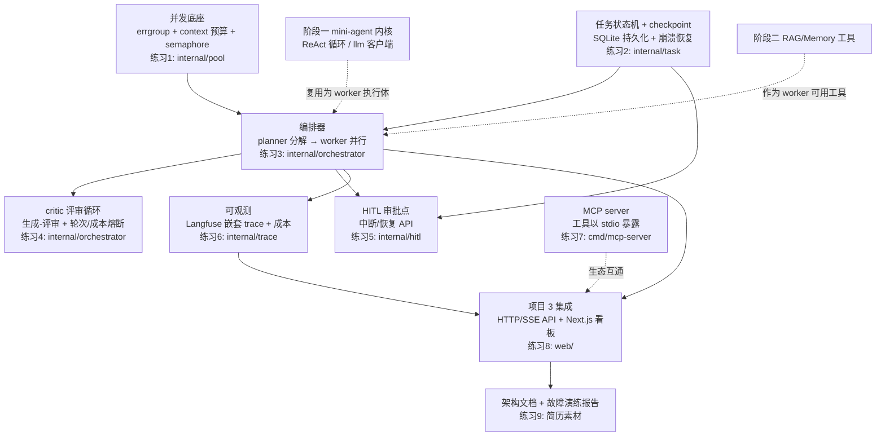

# 阶段三沉淀：深入（多 Agent 编排 + 生产化）

> 状态：⬜ 未开始（第 11-16 周；教程已预写）
> 对应项目：项目 3 `stage-03-multi-agent/`（Go 编排引擎 + TS 实时看板，待创建）
> 前置阅读：`docs/stages/stage-01-foundations.md`（已验收）、`docs/stages/stage-02-rag-memory-evals.md`、`docs/embedding-vectordb-guide.md`、`docs/multi-agent-orchestration-guide.md`（预习材料）、`docs/ROADMAP.md`

---

## 〇、本阶段的项目结构决策

- **项目 3 新建 `stage-03-multi-agent/` 目录**，不再把代码塞进 `mini-agent/`。阶段二是"概念练习进 mini-agent"（RAG/Memory 作为 mini-agent 的能力扩展）；阶段三是一个**独立的产品化项目**——多 Agent 任务系统有自己的 HTTP API、持久化、前端看板，放进 mini-agent 会把"学习框架"和"产品"两个职责混在一起。
- **Go 侧通过 go.mod `replace` 引用 `mini-agent/` 的 agent 内核**（`internal/agent` 的 ReAct 循环、`internal/llm` 的重试+流式客户端），作为编排系统中的"单 agent 执行体"（worker）。理由：体现"复用而非重写"——编排层管的是任务分解、并发、状态、恢复，单 agent 的 ReAct 循环本身不需要重写一遍；这也强制 mini-agent 的内核接口设计得可被外部消费，是阶段一产出的最好检验。注意：`mini-agent` 的 `internal/` 包按 Go 规则不能被 module 外引用，启动时需评估是把内核提升为可导出包，还是把项目 3 放进同一 module——届时在阶段启动的第一个任务里定夺并记录。
- **TS 实时看板放 `stage-03-multi-agent/web/` 子目录**（Next.js），与 Go 引擎通过 HTTP/SSE 通信，同一个 git 目录、两个技术栈。理由：Go 引擎 + TS 看板的"编排引擎与可视化分离"本身就是简历考察点——面试官会问"为什么后端用 Go 而不是全 TS"，答案要落在"goroutine/errgroup 做并发编排的表达力"上。

## 〇.五、阶段知识图谱



读法：实线 = 数据/依赖流向；虚线 = 反哺/复用关系。A（并发底座）和 B（状态持久化）是两根支柱，C（编排器）架在它们之上；D/E 是编排器的两个增强循环（自动质量 + 人工兜底）；F 横切所有环节。R1/R2 体现本阶段最大特点：**不新写 agent 内核，而是把前两阶段的产出组装成系统**。G 是支线（生态互通），I 是最终沉淀。

## 一、这个阶段在学什么

把"单 agent"升级为"可编排、可恢复、可观测、可与人协作的 agent 系统"：

1. **多 Agent 编排模式**：planner-worker、critic/reviewer、handoff、swarm——什么时候拆、怎么拆、拆了付出什么代价。
2. **Go 并发工程化**：errgroup、context 取消与超时预算分配、semaphore 限流——这是 Go 岗位的核心竞争力，用 agent 编排当练兵场。
3. **状态持久化与崩溃恢复**：任务状态机 + checkpoint，进程死掉重启后任务能接着跑。
4. **Human-in-the-loop**：高风险操作前暂停等人工审批，审批后从断点恢复。
5. **可观测**：Langfuse trace，嵌套 span 对应 agent 层级，token 成本核算到每个子任务。
6. **MCP 生态**：把自己的工具以标准协议暴露出去，理解 MCP 与 function calling 的关系。
7. **成本与延迟权衡**：模型分级、并行 vs 串行、预算熔断——生产系统和玩具的分水岭。

## 二、核心概念（必须能脱稿讲出来）

### 1. 为什么需要多 Agent（以及什么时候不需要）

单 agent + 多工具的三个局限：

- **context 膨胀**：所有工具的返回都堆在同一份对话历史里，任务一复杂就超限，且噪声稀释注意力。
- **工具选择准确率下降**：工具数量增多后，模型在一大堆 tool schema 里挑对的那个，准确率明显下降（经验上几十个工具是拐点）。
- **职责混杂**：一个 prompt 既要会规划又要会写代码还要会评审，prompt 越写越长、互相干扰。

但多 agent 的代价同样真实：**状态一致性**（多个 agent 各自有 context，怎么共享中间结果）、**成本倍增**（每个 agent 一份 system prompt + 历史，token 翻几倍）、**调试困难**（一次失败要排查是哪一环）。所以判断标准是：**"能单 agent 就别多 agent"**——先加工具、加 RAG，真的撞到 context/准确率/职责三堵墙之一，再拆。面试被问"你怎么设计多 agent 系统"，先讲这句再讲架构，是区分"真做过"和"背概念"的点。

### 2. 编排模式四选

| 模式 | 结构 | 适用场景 |
| --- | --- | --- |
| planner-worker | planner 把任务分解成子任务 → 多个 worker 并行执行 → 汇总结果 | 任务可分解、子任务相对独立（"调研三个方案并对比"）；本阶段主线 |
| critic/reviewer | generator 产出 → critic 评审 → 不通过则打回重做，循环到通过或熔断 | 产出质量可检查的场景（写代码、写报告） |
| handoff | 一个 agent 判断"这不是我的活"，把对话连同上下文转交给专职 agent | 路由/分诊场景（客服系统：售前→售后→技术）；子任务是串行接力而非并行 |
| 群聊/swarm | 多 agent 自由对话，无固定拓扑 | 研究前沿，生产可控性差，了解即可 |

要点：planner-worker 是"分解-并行-汇总"，handoff 是"路由-接力"；前者管理者视角，后者流水线视角。critic 可以叠加在任何模式上（本阶段叠加在 worker 产出之后）。

### 3. 任务状态机与 checkpoint

多 agent 系统的本质是**一个会跑几分钟到几小时的长时间任务**，进程随时可能死。设计：

- 状态机：`pending → planning → running → (waiting_human) → done / failed`，每次迁移都是一次显式事件。
- **每个子任务的状态变更都落盘（checkpoint）**——不是任务结束才存，而是"每完成一步就存一步"。崩溃恢复 = 重启后从 SQLite 读出最后一个 checkpoint，跳过已完成的子任务继续跑。
- 推论：子任务执行最好是幂等的（见第 5 条），否则恢复时会重复执行已做过的副作用。

面试考点：这和"对话历史即状态"（阶段一）是同一个思想在系统层的放大——**状态外置，进程无状态**。

### 4. Go 并发编排三件套

- **errgroup**（`golang.org/x/sync/errgroup`）：`go` + `WaitGroup` 的进化版。`g.Go(fn)` 启动 worker，`g.Wait()` 等全部结束并返回第一个错误；`errgroup.WithContext` 派生的 ctx 会在任一 goroutine 出错时取消——天然实现"一错全停"。
- **context 取消与超时预算**：一个总 deadline 不能裸传给所有层级。正确做法是**预算分配**：总任务 10 分钟 → planner 2 分钟 → 每个 worker 3 分钟 → worker 内单次 LLM 调用 60 秒。每级用 `context.WithTimeout` 从父 ctx 派生，超时自下而上级联取消。
- **semaphore 限流**（`golang.org/x/sync/semaphore` 或带缓冲 channel）：worker 池并发度不能无限——LLM API 有 rate limit，本地资源有限。worker 开工前 `Acquire(1)`，结束 `Release(1)`，把并发度钉在上限内。

### 5. 失败处理四件套

- **重试以幂等为前提**：阶段一的重试退避只管"读"类调用；编排层重试会重放整个子任务，如果子任务有副作用（写了文件、发了请求），重试=副作用翻倍。
- **幂等键**：给每个子任务生成 idempotency key，执行前查"这个 key 是否已成功过"，成功过就直接返回旧结果——崩溃恢复和重试共用这一个机制。
- **降级**：主模型超时/限流 → 换便宜模型；critic 连续不可用 → 跳过评审直接放行（记 log）。降级是"有计划的牺牲质量保可用"。
- **死信**：子任务重试 N 次仍失败 → 进死信队列/标记 failed，不拖垮整个任务，最后汇总报告里呈现。

另外一条 LLM 特有的：**LLM 输出是不确定的**，planner 输出的 JSON 计划必须过 schema 校验才能进状态机，校验失败要么让 planner 带错误信息重试，要么任务直接 failed——绝不能"指望模型每次都输出对的格式"。

### 6. Human-in-the-loop（HITL）

- 高风险工具（删数据、发邮件、花钱的 API）执行前必须暂停，等人工 approve/reject。
- 实现原理 = 第 3 条的直接应用：状态机进入 `waiting_human` 并落盘，worker 挂起（或任务整体让出）；审批 API 收到人工决定后，把决定写进 checkpoint，任务从断点恢复执行。
- **关键设计点：状态外置才能"暂停-恢复"**。如果状态在内存里（一个阻塞中的 channel），进程一重启审批点就没了。这也是"为什么编排引擎要配数据库"的最直接答案。

### 7. 可观测：trace 对应 agent 层级

- **trace/span 层级 = agent 层级**：一次任务一个 trace；planner 一个 span；每个 worker 一个子 span；worker 内部每次 LLM 调用、每次工具执行是更深层 span。出问题时下钻顺序：任务 → 子任务 → 单次调用。
- **token 成本核算**：每个 span 记 input/output token，汇总出"这个任务花了多少钱、哪个 worker 最贵"——成本优化（模型分级、砍 prompt）都靠这个数据驱动。
- **agent eval 分两层**：结果评估（最终产出对不对）和轨迹评估（过程是否合理——分解得对不对、工具选对没有、有没有绕路）。结果好轨迹差（蒙对的）和结果差轨迹好（运气差）要分开看。
- 工具：Langfuse 自托管，Go 侧通过其 API/SDK 上报。

### 8. MCP：工具生态的"USB-C"

- MCP（Model Context Protocol）是 Anthropic 推的开放协议，解决"每个 agent 框架各自造工具接入方式"的碎片化问题——工具方实现一次 MCP server，任何 MCP client（Claude、IDE、自研 agent）都能用。
- 架构：server（暴露能力）/ client（消费能力，通常内嵌在 agent 里）/ host（承载 client 的应用）。传输层常用 stdio（本地进程）或 HTTP+SSE。
- 三原语：**tools**（可执行的函数，≈ function calling 的工具）、**resources**（可读的数据，≈ 文件/文档）、**prompts**（预置 prompt 模板）。
- 与 function calling 的关系：**不同层**。function calling 是"模型 ↔ 应用"之间模型请求执行工具的机制；MCP 是"应用 ↔ 工具提供方"之间的标准化接入协议。MCP client 拿到 server 的工具列表后，通常就是转成 function calling 的 tool schema 喂给模型。

## 三、知识梳理（复习资料）

> 目标：只看本节，就能通过本阶段相关的面试提问。随学习推进持续补充。

### 3.1 自问自答考点清单

**Q1：什么时候该用多 agent，什么时候不该？**
不该（默认）：单 agent + 工具能解决的，先优化 prompt、加 RAG、拆工具描述。该的三个信号：① context 膨胀到压缩都救不回来；② 工具数量多到模型选不准（几十个）；③ 职责混杂到一个 prompt 写不下（又要规划又要执行又要评审）。多 agent 是用"状态一致性 + 成本 + 调试复杂度"换"单一职责 + 可控 context"，是 trade-off 不是升级。

**Q2：planner-worker 和 handoff 有什么区别？**
planner-worker 是**分解-并行-汇总**：planner 一次性把任务拆成子任务，worker 并行跑，结果汇总给 planner/汇总节点；适合可分解的独立子任务。handoff 是**路由-接力**：任一时刻只有一个 agent 持有对话，它判断"该换人了"就把控制权（连同上下文）转给下一个；适合分诊/流程串行场景（客服转接）。判断题眼：子任务能并行就是 planner-worker，必须串行接力就是 handoff。

**Q3：多个 agent 之间怎么共享上下文？**
两种范式。① **黑板（blackboard）**：共享存储（DB/内存结构），各 agent 读写公共状态——本项目的 checkpoint/SQLite 就是黑板，子任务产出写进去，后续子任务读出来；优点是持久、可恢复，缺点是要设计 schema 和并发写。② **消息传递**：agent 之间直接传消息（handoff 的上下文交接、A2A 协议）；优点是边界清晰，缺点是状态散在消息流里难恢复。生产系统常混用：黑板存事实，消息传指令。

**Q4：崩溃恢复怎么设计？checkpoint 存什么？**
核心是"状态外置 + 每步落盘"。checkpoint 内容：任务 ID、状态机当前状态、每个子任务的（状态、输入、输出、幂等键、已耗 token）、待审批项。恢复流程：重启 → 读 checkpoint → 已 done 的子任务跳过 → running 中被打断的按幂等键判断是否重放 → waiting_human 的恢复审批等待。存的位置要兼顾"查询"（看板要读状态）和"事务"（状态迁移要么全成要么全不成），SQLite/Postgres 天然合适。

**Q5：多 agent 系统成本怎么控制？**
四招：① **模型分级**——planner/critic 用强模型，执行型 worker 用便宜模型（DeepSeek 定价下分级收益明显）；② **预算熔断**——任务级 token/金额预算，超了直接 failed，防止 critic 循环烧钱；③ **缓存与复用**——相同子任务的 system prompt 前缀命中 prompt 缓存，重复检索结果复用；④ **砍 context**——worker 只拿自己需要的子任务描述，不背整个任务历史。成本核算依赖 trace 数据（每 span 记 token），没有观测就没有成本控制。

**Q6：HITL 的暂停-恢复实现原理？**
状态机进入 `waiting_human` 并 checkpoint 落盘 → 执行侧退出/挂起（不是 sleep 阻塞占着 goroutine，而是任务让出，由审批事件驱动恢复）→ 人工通过 API 提交 approve/reject → 服务端把决定写入 checkpoint 并把状态迁回 running → 从断点子任务继续。关键：审批决定也是状态的一部分，进程重启后"已批未执行"的任务必须能继续——所以不能只靠内存 channel 等审批。

**Q7：errgroup 和手动 channel + WaitGroup 编排有什么区别？**
errgroup 解决三件事：① 收集第一个 error 不用自己写 error channel；② `WithContext` 在某 goroutine 出错时自动取消 ctx，其余 worker 能感知退出；③ 代码意图直白（一组相关 goroutine）。手动 channel 更灵活——能做流式结果收集、动态增减 worker、复杂的 fan-in/fan-out——但取消传播、error 聚合都要自己写，容易漏（比如忘 close channel 导致 Wait 死锁）。经验法则：固定一组任务、等全部完成 → errgroup；需要流水线/动态拓扑 → channel。本项目两者都用：worker 池用 errgroup + semaphore，结果上报用 channel。

**Q8：context 超时预算怎么在多级调用中分配？**
原则：**越下层预算越小，上层留余量做善后**。例：任务总预算 10min → planner 2min → 单 worker 3min → 单次 LLM 调用 60s → 单次 HTTP 30s。每层 `context.WithTimeout(parent, budget)` 派生，下层层级超时先触发、返回可处理的错误，上层还有时间记 checkpoint、走降级；如果全局只设一个死线，到点所有层一起死，连"记录失败状态"的机会都没有。另外取消是级联的：父 ctx 取消，所有子 ctx 立即收到，goroutine 必须 select ctx.Done() 才能真的停下来。

**Q9：MCP 解决什么问题？和 function calling 什么关系？**
MCP 解决**工具接入的标准化**：没有 MCP 时，N 个 agent 框架 × M 个工具 = N×M 种接法；有了 MCP，工具方写一个 server，所有 client 通用——类似 USB-C 统一了充电口。三原语：tools（可执行函数）、resources（可读数据）、prompts（模板）。和 function calling 是不同层：function calling 是模型与应用之间的机制（模型输出结构化调用请求）；MCP 是应用与工具提供方之间的协议（怎么发现工具、怎么调用、结果怎么回）。典型链路：MCP client 列出 server 的 tools → 转成 function calling schema 给模型 → 模型选中 → client 通过 MCP 调 server 执行。

**Q10：agent 系统怎么评估？**
分两层。**结果评估**：最终产出对不对——有标准答案的用精确匹配/覆盖率，开放任务用 LLM-as-judge（注意其偏差，阶段二已学）。**轨迹评估**：过程对不对——planner 分解是否合理、worker 工具选对没有、步数是否异常（绕路）、critic 拦截了几次。两层要分开看：结果对但轨迹绕 = 运气，结果错但轨迹合理 = 单点故障好修。工程上靠 trace 落数据，eval 脚本离线回放分析；指标示例：任务成功率、平均子任务数、平均 token 成本、人工审批介入率。

**Q11：并发跑多个 worker，LLM API 限流（429）怎么处理？**
三道防线：① **semaphore 限并发度**在源头——并发 worker 数 ≤ API 配额能承受的量，比事后重试便宜；② 单次调用层复用阶段一的**指数退避重试**（尊重 `Retry-After`，加 jitter 防惊群——多个 worker 同时被限流时退避时间要随机错开，否则一起重试又一起被限）；③ 持续限流走**降级/排队**：换备用模型，或把子任务重新入队延后执行。关键认知：429 在并发场景是常态不是异常，架构上要把"被限流"当预期路径设计。

**Q12：planner 输出的计划怎么保证可用？**
LLM 输出不确定性 → **结构化输出 + 校验兜底**。① 用 JSON schema/工具调用约束 planner 输出格式；② 代码侧 schema 校验（字段、类型、子任务数上限、依赖是否成环）；③ 校验失败把错误信息喂回 planner 重试（有次数上限）；④ 重试耗尽任务 failed 进人工。原则：模型负责"生成"，代码负责"把关"——任何进状态机的 LLM 输出都必须先过确定性校验。

### 3.2 易混淆概念对比

| 概念 A | 概念 B | 区别要点 |
| --- | --- | --- |
| 单 agent 多工具 | 多 agent | 前者一份 context 背所有工具，简单便宜；后者职责隔离、context 可控，但状态/成本/调试代价大。默认前者，撞墙再拆 |
| planner-worker | handoff | 分解-并行-汇总（管理者）vs 路由-接力（流水线）；判断题眼：子任务能否并行 |
| 重试 | 幂等 | 重试是"再做一次"的动作，幂等是"做多次 = 做一次"的性质；没有幂等键的重试会让副作用翻倍 |
| 同步编排 | 事件驱动 | 编排器主动推进状态机（本项目，简单可调试）vs 状态变更发事件、各 agent 订阅响应（弹性好但链路隐式难追踪）；小规模先同步 |
| trace | log | log 是离散事件点，trace 是有父子层级的调用树（span 嵌套）；排查"哪个环节慢/贵"靠 trace，排查"发生了什么"靠 log |
| MCP | function calling | 应用↔工具提供方的接入协议 vs 模型↔应用的调用机制；MCP 工具最终常转成 function calling schema 给模型 |
| 结果评估 | 轨迹评估 | 产出对不对 vs 过程对不对；结果好轨迹差是蒙的，结果差轨迹好是单点故障 |
| checkpoint | 对话历史 | 系统级状态快照（任务/子任务/审批，存 DB）vs 单 agent 会话内状态（messages）；崩溃恢复靠前者，模型推理靠后者 |

### 3.3 任务全生命周期时序图

```
用户          编排器             planner        worker×N          critic        审批人        SQLite
 │ 提交任务      │                 │              │                │              │            │
 │────────────▶│ pending          │              │                │              │            │
 │             │═══ checkpoint ═══════════════════════════════════════════════════════════════▶│
 │             │ planning         │              │                │              │            │
 │             │────────────────▶│ 分解为子任务  │                │              │            │
 │             │                 │ (JSON 计划)   │                │              │            │
 │             │◀────────────────│ schema 校验   │                │              │            │
 │             │═══ checkpoint: 计划落盘 ════════════════════════════════════════════════════▶│
 │             │ running          │              │                │              │            │
 │             │──── errgroup + semaphore 并发分发 ──▶│           │              │            │
 │             │                  │              │ 子任务1 done   │              │            │
 │             │═══ checkpoint: 每完成一个子任务落一次 ═══════════════════════════════════════▶│
 │             │                  │              │ (崩溃→重启: 读 checkpoint, 幂等键跳过已完成) │
 │             │                  │              │ 高风险子任务    │              │            │
 │             │ waiting_human ◀──┼──────────────┤ 请求审批       │              │            │
 │             │═══ checkpoint: 审批点落盘 ═══════════════════════════════════════════════════▶│
 │             │                                     ◀──── approve/reject ────│               │
 │             │ running          │              │                │           (决定也落盘)    │
 │             │──────────────────┼──────────────┼───────────────▶│ 评审产出     │            │
 │             │                  │              │                │ 不通过→打回  │            │
 │             │                  │              │  (轮次/成本超预算→熔断 failed)│             │
 │             │ done             │              │                │ 通过        │            │
 │             │═══ checkpoint: 终态落盘 ════════════════════════════════════════════════════▶│
 │◀────────────│ 汇总结果          │              │                │              │            │
```

要点：每条 `═══` 是一次 checkpoint 落盘——**状态机每迁移一次就持久化一次**，这是崩溃恢复的全部秘密；审批人的决定同样是 checkpoint 内容；critic 循环有双重熔断（轮次上限 + token 预算）。

### 3.4 一句话记忆卡片

- 能单 agent 就别多 agent——多 agent 是用状态、成本、调试复杂度换职责隔离。
- 状态机每迁移一次就落盘一次，崩溃恢复 = 读 checkpoint 接着跑。
- 重试的前提是幂等，幂等的落地是幂等键。
- context 超时要分级预算，全局一个死线 = 连记录失败的机会都没有。
- LLM 输出进状态机之前，必须过 schema 校验——模型负责生成，代码负责把关。
- MCP 是工具生态的 USB-C，和 function calling 是两层东西。

---

## 四、注意事项（踩过的坑 & 易错点）

> 随练习推进逐条累积。预置本阶段已知坑：

1. **errgroup 的错误语义要想清楚再选**：`errgroup.WithContext` 下任一 goroutine 出错会取消 ctx、其余 worker 被中止——这是"一错全停"语义。如果业务要"收集部分结果"（三个调研任务挂了一个，另外两个的结论仍要汇总），就不能依赖 errgroup 的取消，要让每个 worker 自己吃掉错误、把"失败"作为结果值返回，编排器最后统计成败比例。两种语义没有对错，选错才出问题。
2. **context 超时要分级分配，不能全局一个死线**：总预算直接透传到最底层，到点所有层一起超时，上层的降级、checkpoint、善后逻辑全部没机会执行——故障现场什么状态都没留下，恢复无从下手。正确做法是逐层 `WithTimeout` 递减预算（见 3.1 Q8）。
3. **planner 输出的 JSON 计划必须过 schema 校验才能进状态机**：LLM 输出是不确定的，再强的 prompt 也不能保证每次都输出合法格式。未校验的计划直接驱动子任务分发，等于把系统的正确性押在模型运气上。校验失败要有明确路径：带错误信息让 planner 重试（限次），重试耗尽任务 failed。

## 五、已完成

- ✅ 阶段三教程预写（本文档）

## 六、下一步（练习/任务清单，带状态）

| #   | 练习                                                                                              | 考察点                              | 计划代码位置                              | 状态 |
| --- | ------------------------------------------------------------------------------------------------- | ----------------------------------- | ----------------------------------------- | ---- |
| 1   | Go 并发热身：errgroup + context 预算的 worker pool（带 semaphore 限流）                            | Go 并发基本功                       | `stage-03-multi-agent/internal/pool`       | ⬜ 未开始（骨架与参考答案将在阶段启动时按 AGENTS.md 约定同步创建） |
| 2   | 任务状态机 + SQLite checkpoint 持久化 + 崩溃恢复演练（kill 进程→重启→续跑）                        | 状态机设计、持久化                  | `stage-03-multi-agent/internal/task`       | ⬜ 未开始（同上） |
| 3   | Planner/Worker 编排器：planner 输出结构化 JSON 计划（schema 校验），worker 复用 mini-agent 内核   | 编排模式落地、内核复用              | `stage-03-multi-agent/internal/orchestrator` | ⬜ 未开始（同上） |
| 4   | Critic 评审循环：生成-评审打回重做 + 最大轮次 / token 成本双重熔断                                  | 质量控制、成本熔断                  | `stage-03-multi-agent/internal/orchestrator` | ⬜ 未开始（同上） |
| 5   | Human-in-the-loop 审批点：中断/恢复 API + CLI 演示（高风险子任务暂停，approve 后续跑）              | 状态外置、事件驱动恢复              | `stage-03-multi-agent/internal/hitl`       | ⬜ 未开始（同上） |
| 6   | Langfuse trace 接入：嵌套 span 对应 agent 层级（任务→子任务→单次 LLM 调用）+ 每 span token 成本   | 可观测、成本核算                    | `stage-03-multi-agent/internal/trace`      | ⬜ 未开始（同上） |
| 7   | MCP server：把 mini-agent 的工具以 stdio 暴露（tools/list、tools/call），可被任意 MCP client 消费 | MCP 协议理解                        | `stage-03-multi-agent/cmd/mcp-server`      | ⬜ 未开始（同上） |
| 8   | 项目 3 集成：Go 编排引擎 HTTP/SSE API（提交任务、查状态、审批、流式进度）+ Next.js 实时看板       | 全栈产品化、SSE 复用                | `stage-03-multi-agent/`（引擎）+ `web/`（看板） | ⬜ 未开始（同上） |
| 9   | 架构文档 + 故障演练报告：为什么这样拆 agent、失败如何处理、崩溃恢复/限流/熔断的演练记录            | 简历素材、表达输出                  | `stage-03-multi-agent/docs/`（文档型练习，无代码） | ⬜ 未开始（同上） |

> 按 AGENTS.md 约定：阶段启动时 AI 只写骨架 + `TODO(练习N)` 标注，参考答案同步存放于 `docs/solutions/stage-03/`，且答案必须实际编译验证（`go build` / `go vet` / `go test`）通过后方可入库；进阶/加分项必须有经验证的完整实现，不允许只写思路。

## 七、阶段验收标准（checklist）

- [ ] 能手画任务全生命周期时序图（对照 3.3），讲清每次 checkpoint 落盘的时机与内容
- [ ] 能流畅回答 3.1 节全部考点，尤其"什么时候不该用多 agent"这类反直觉题
- [ ] 讲清四种编排模式的取舍：为什么项目 3 选 planner-worker + critic 叠加，而不是 handoff 或 swarm
- [ ] 项目 3 可演示完整闭环：提交任务 → planner 分解 → 并发 worker → critic 评审 → 人工审批 → 看板实时可见 → 成本可查
- [ ] 崩溃恢复可演示：任务跑到一半 kill 进程，重启后从 checkpoint 续跑且不重复已完成的副作用
- [ ] 产出架构文档 + 故障演练报告：能讲清"为什么这样拆 agent、失败如何处理"（对齐 ROADMAP 验收口径），含 trace 截图与成本数字
